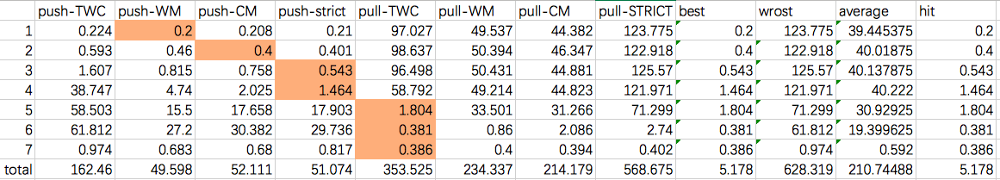

# GSWITCH
GSWITCH is a pattern-based algorithmic autotuning system that dynamically switched to the suitable optimization variants with negligible overhead.
Specifically, It is a CUDA library targeting the GPU-based graph applications, it supports both vertex-centric or edge-centric abstractions.
By far, GSWITCH can automatically determine the suitable optimization variants in Direction (push, pull), data-structure (Bitmap, Sorted Queue, Unsorted Queue), Load-Balance (TWC, WM, CM, STRICT, 2D-partition), Stepping (Increase, Decrease, Remain), and Kernel Fusion (Standalone, Fused).
The fast optimization transition of GSWITCH is based on a machine learning model trained from 600+ real graphs from the [network repository](http://networkrepository.com).
The model can be resued by new applications, or be retrained to adapt to new architectures.
In addition, GSWITCH provides succinct programming interface which hides all low-level tuning details. Developers can implements their graph applications with high performance in just ~100 lines of code.

## Why GSWTICH

As GPUs provide higher parallelism and memory bandwidth than traditional CPUs, GPUs become a promising hardware to accelerate graph algorithms. Many recent works have explored the potential of using GPUs for data-intensive graph processing. Although the primary optimizations of these works are diverse, we notice that most of them are trying to find a 'one size fits all' solution. This leads to the mismatch and complication issues:

 **Mismatch**: Previous GPU-based graph frameworks may incur performance hits due to suboptimal strategies. Previous works accelerated graph primitives to run truly fast on some particular graphs or algorithms, however, their performance might fell dramatically when facing an unmatched situation. For example, Figure 2 shows that differents graph require different load-balance strategies. Figure 3 shows the performance loss if we only use push model in frontier expansion.


*Figure 1: Best load-balance for different graph*


*Figure 2: performance loss*

 **Complication**: Priori knowledge is required for users to make favorable decisions, especially from a mass of choices. A bulk synchronous parallel (BSP)-style graph application achieves its best performance only if correct strategies are chosen in every super-step. Unfortunately, the number of these performance-crucial strategies is very large, or worse yet, various combinations of these strategies form a huge tuning space. Data analysts should not spend their labor on wrestling with the tedious and complex performance tuning. Offloading the decision-making to a fully auto-tuning runtime could be a better choice.

## Dependency

 - nvcc 7.5+
 - cmake
 - moderngpu

## Build Instruction

Clone GSWITCH code to local server and build GSWITCH with CMake.

```shell
$ git clone https://github.com/PAA-NCIC/GSWITCH.git
$ cd GSWITCH
$ mkdir build && cd build
$ cmake ../ && make -j8
```

## Usage

Here are the basic useages of pre-integrated applications (BFS, CC, PR, SSSP, BC) in GSWITCH.

```shell
./EXE <graph_path> [options]
[-r, --src=<int>]      Choose a root vertex. (Default: ch
                       oose randomly).
[-v, --verbose]        Print verbose per iteration info. 
                       (Default: quiet mode)
[-V, --validation]     Process the CPU reference validati
                       on. (Defaule: no validation)
[-H, --with-header]    Input file has header (e.g. nverte
                       xs, nvertexs, nedges, Default: no 
                       header).
[-W, --with-weight]    Input file has weight.(Default: no
                        weight value)
[-i, --ignore-weight]  Ignore the graph weight.(Default: 
                       false)
[-d, --directed]       Graph is directed.(Default: undire
                       cted)
[-c, --configs=Push-Queue-CM-Fused]
                       Set debug strategies, use - to sep
                       arater them (Default: <empty>).
[-D, --device=<int>]   Choose GPU for testing (Default: 0
                       )
[-j, --json=<string>]  set the json path (Default: 0)
```

*Note: By using `--configs`, you can force the applications to run with the static strategies. (No dynamic transition).

## APIs

To customize your own application. you should provide at most six small functions.

<table>
  <thead>
    <tr>
      <th><strong>APIs</strong></th>
      <th><strong>Description</strong></th>
    </tr>
  </thead>
  <tbody>
    <tr>
      <td width="52%"><code class="highlighter-rouge">filter(int vidx, G g)</code></td>
      <td>required, stream all the vertices(or edges) and filter out active ones; then update their value.</td>
    </tr>
    <tr>
      <td><code class="highlighter-rouge">WA emit(int vidx, E* e, G g)</code></td>
      <td>required, describe the message from one vertex to another.</td>
    </tr>
    <tr>
      <td><code class="highlighter-rouge">comp(WA* vdata, WA msg, G g)</code></td>
      <td>required, describe how the message is processed in the target vertex.</td>
    </tr>
    <tr>
      <td><code class="highlighter-rouge">compAtomic(WA* vdata, WA msg, G g)</code></td>
      <td>ditto, but an atomic version.</td>
    </tr>
    <tr>
      <td><code class="highlighter-rouge">cond(int vidx, E* e, G g)</code></td>
      <td>optional, help to omit useless updates.</td>
    </tr>
    <tr>
      <td><code class="highlighter-rouge">exit(int vidx, E* e, G g)</code></td>
      <td>optional, customed exit condition.</td>
    </tr>
  </tbody>
</table>

## Example

Here is a sample codes of BFS for graph soc-orkut. For more details please visit `./application/bfs.cu`

```c++
#include "gswitch.h"
using G = device_graph_t<CSR, Empty>;

struct BFS:Functor<VC,int,Empty,Empty>{
  __device__ Status filter(int vid, G g){
    int lvl = *wa_of(vid);
    if(lvl == g.get_level()) return Active;
    else if (lvl < 0) return Inactive;
    else return Fixed;
  }
  __device__ int emit(int vid, Empty *w, G g) {return g.get_level();}
  __device__ bool cond(int v, int newv, G g) {return *wa_of(v)==-1;}
  __device__ bool comp(int* v, int newv, G g) {*v=newv; return true;}
  __device__ bool compAtomic(int* v, int newv, G g) {*v=newv; return true;}
};

int main(){
  // load graph
  for(level=0;;level++){
    inspector.inspect(as, g, f, stats, fets, conf);
    if(as.finish(g, f, conf)) break;
    selector.select(stats, fets, conf);
    executor.filter(as, g, f, stats, fets, conf);
    g.update_level();
    executor.expand(as, g, f, stats, fets, conf);
  }
  // copy data back
}
```
run the with `./BFS soc-orkut.mtx --with-header --src=0 --device=0 --verbose`:


*Figure 3: BFS example*


*Figure 4: the decision path of BFS for graph orkut*


## Applications

### Typical applications

Here we describe five typical graph applications in our framework to show how to translate real applications into our filter-expand framework: the Breadth-first search algorithm (BFS), the connected components algorithm (CC), the PageRank algorithm (PR), the single source shortest path algorithm (SSSP), and the betweenness centrality algorithm (BC). These five benchmarks can cover the majority of real-world graph applications.

**Breadth-First Search**. A BFS algorithm generates the breadth-first search tree of a graph from a source vertex *root* and compute the shortest jump hops from the *root* to all vertices reachable from it. Both of each vertex and each edge will be processed at most once. In BFS, any race condition between edges visiting a vertex is benign, thus we can perform pruning when we find a vertex that has been touched in the current iteration. 

In our framework, The BFS algorithm is implemented in vertex-centric abstraction. We use a `filter` function to mark a vertex whose *label* equals to the BFS depth as active and `emit` the *label+1* to the inactive vertices. Because the update process of BFS is idempotent, both of the `comp` and `compAtomic` function can do the update without atomic operations.

**Connected Components**. For undirected graphs, we say a group of vertices as a connected component when all vertices in the group can reach one another. Soman shows that the edge-centric implementation may be a better choice. In the edge-centric mode, each edge of the graph tries to assign its two end vertices with the same ID. A pointer-jumping is used to reduce the multi-level tree into star-like, which ensures that once the two end vertices of an edge have the same ID, they will remain the same in the following iteration. By repeating these two steps until no vertex changes, the algorithm terminates and outputs the result.

We implement the CC algorithm also as edge-centric in GSWITCH. At the beginning, all the edges are active, and we use a `emit` function to make the lower vertex writes its ID to the higher vertex in the expansion step. After expansion, we add an extra pointer-jumping phase to perform the root-finding procedure. At last, the `filter` function will mark the edge whose two end vertices have the same ID as fixed and mark the other edges as active. When all the edges become fixed, the whole algorithm terminates.


**PageRank**. Google first introduced the PageRank algorithm to calculate the relative importance of webpages. Given a graph *G=<V,E>*, a damping factor *d (0<d<1)*, the PR value of a vertex *v* is calculated by:

$$ PR[v] = \frac{1-d}{|V|} + d\sum_{u\in V^-(v)}{\frac{PR[u]}{dg^+(u)}} $$

At first, the PR values of all the vertices are set all the same and then use the equation above to compute until all of the differences of PR values between iterations drop to below a threshold value. GraphLab has introduced a Delta-PageRank algorithm to only send their changes (deltas) in PR values to their neighbors, thus not all the vertices are active during each iteration, which means less data movement.

In GSWITCH, we implement both of the traditional PageRank and the Delta-PageRank. In traditional PageRank, the `emit` function send the PR value of a vertex to its neighbors, and the new PR value is calculated in the `filter` function. In Delta-PageRank, the `emit` function only send the deltas in the last iteration, and the `filter` function will accumulate the sum of delta contributions from their neighbors. When the accumulated delta is large enough, the vertex is marked as active and updates its PR value. Both of the two algorithms have the same `comp` and `compAtomic` functions. They accumulate the messages sent from neighbors.


**Single-Source Shortest Path**. An SSSP problem takes a weighted graph and a rooted vertex as input, and compute the shortest path distance from the root vertex to each vertex reachable from it. For graphs with negative weight, Bellman-Ford algorithm can report the existence of a negative cycle. For graphs with non-negative weight, the distance of each vertex decrease monotonously, the delta-stepping algorithm is used to make a balance between work-efficiency and parallelism. As described in a recent work (Davidson2014Work), they used a Near-Far classification to preferentially update a group of vertices based on distance scoring heuristic.

We implement the sssp algorithm with our dynamic window optimization to overcome the drawback of the irregular workloads across iterations. For an edge *e* connected vertices of *v* and *u*, the `emit` function send the sum of the distance value of *v* and the weight of *e*. Then we compare the received message and the distance of *u* in the `comp` and `compAtomic` function. Note that in `compAtomic`, we use `atomicMin` to ensure atomicity. Finally, we use a `filter` function to choose the vertices whose distance fall in the dynamic window. 

**Betweenness Centrality**. Centrality is widely used to indecate the importance of nodes in social graphs. The commonest formulation of the BC problem is in Brandes's work. For a graph *G=<V, E>*, and a root vertex *root*. Let the *nsp[v]* be the number of the shortest paths from *root* to *v*. The BC value of the parent vertex $p$ of the $v$ in the BFS tree rooted as *root* can be calculated according to:

$$ BC[p] = \sum_{v\in child(p)}{\frac{nsp[p]}{nsp[v]}(BC[v]+1)} $$

The algorithm is composed of two phases: a forward phase and a backward phase. The forward phase computes the number of the shortest paths from the $root$ to each vertex in BFS order. The backward phase computes the BC value using the equation above in a reversed BFS order.

In GSWITCH, We also implement the forward and backward phases. In the forward phase, we use a `filter` function similar with BFS to choose the active vertices and use the emit function to send the number of the shortest paths to inactive vertices. The `comp` and `compAtomic` functions are used to sum the numbers of the shortest paths. In the backward phase. A `filter` function will choose and update the vertices according to the level computed in the forward phase. A `emit` function will send BC value to its neighbors, while the `comp` and `compAtomic` function do the sum work.

### Extended applications

Besides the above five application, we will constantly updated other applictions here:

**Graph Coloring**. Graph coloring partitions the vertices of a graph such that no two adjacent vertices share the same color. In most of cases, applications relying on this algorithm do not require the optimal coloring, such as Pannotia. Doing such coloring is among the first steps in many parallel graph algorithms. In the initialization step, each vertex is labeled with a random integer value. The algorithm then launches multiple iterations, each responsible for labeling one color. For each vertex, the algorithm compares its vertex value with that of its neighboring vertices. If the vertex value of a given node happens to be the largest (or smallest) among its neighbors it marks itself with the current iteration colors (one each for the largest and smallest in each set). The algorithm terminates when all vertices are colored.

We implement the GC algorithm as vertex-centric in GSWITCH. We use the `filter` function to filter out the uncolored vertices as our active set, then we color the vertice whose local maximum vertex id collected in the last iteration is smaller then it's own vertex id. The `emit` function is used to send vertex id to each vertex's neighbors. The `comp` and `compAtomic` compute the max vertex id of each vertex's neighbors. This naive implementation has many optimization such as multi-hash and min-max, which can make the algorithm converges faster.


## Performance

Here we show 100 cases for each application (BFS,CC,PR,SSSP,BC) compared with [Gunrock](https://github.com/gunrock/gunrock) on k40m,P100,and V100. (P.S. Note that some graph below have the same names with the graph in other well-known dataset such as SNAP, but **THEY ARE DIFFERENT**.)

### K40m

**DOBFS** (both without tuning parameters)

| **Dataset** | **Gunrock** | **GSWITCH** |
| ------- | ------- | ------- |
|cvxqp3.mtx| 5.87296485901| 1.6582|
|SOPF_FS_b39_c7.mtx| 6.72578811646| 1.77515|
|bundle1.mtx| 5.12003898621| 1.36597|
|scircuit.mtx| 16.7441368103| 8.01489|
|fe-ocean.mtx| 29.777765274| 12.519|
|socfb-Vanderbilt48.mtx| 2.52294540405| 0.858887|
|sme3Da.mtx| 25.4499912262| 5.25195|
|neos1.mtx| 2.70509719849| 0.912842|
|crystk02.mtx| 70.0058898926| 10.2581|
|3Dspectralwave2.mtx| 5.04207611084| 2.27588|
|3D_51448_3D.mtx| 32.0639610291| 4.72998|
|ibm_matrix_2.mtx| 36.4141464233| 4.84082|
|g7jac140sc.mtx| 18.6948776245| 2.54028|
|case39.mtx| 9.09209251404| 2.06079|
|socfb-UMass92.mtx| 4.33206558228| 0.902344|
|fp.mtx| 5.09595870972| 1.87793|
|neos2.mtx| 2.60519981384| 0.83667|
|c-73.mtx| 5.66005706787| 1.91406|
|frb50-23-1.mtx| 0.723123550415| 0.360107|
|TF17.mtx| 13.6611461639| 1.479|
|bas1lp.mtx| 4.16803359985| 0.969971|
|mri1.mtx| 3.86190414429| 1.73706|
|g7jac160sc.mtx| 31.3901901245| 3.23877|
|shar_te2-b2.mtx| 12.5088691711| 1.56421|
|socfb-Mississippi66.mtx| 3.36003303528| 0.858887|
|g7jac180.mtx| 16.1709785461| 2.86084|
|g7jac180sc.mtx| 15.9480571747| 2.87598|
|in-2004.mtx| 18.1181430817| 8.17505|
|bcsstk35.mtx| 31.7490100861| 8.92505|
|nemeth24.mtx| 104.316947937| 25.0598|
|g7jac200sc.mtx| 12.3958587646| 2.83691|
|turon_m.mtx| 18.4290409088| 8.60693|
|gas_sensor.mtx| 17.7128314972| 7.93408|
|ASIC_680ks.mtx| 12.7611160278| 3.99805|
|sgpf5y6.mtx| 4.42910194397| 2.02197|
|pds-70.mtx| 4.63199615479| 2.25073|
|TSOPF_FS_b162_c3.mtx| 7.78794288635| 1.67993|
|invextr1_new.mtx| 25.9199142456| 7.88403|
|rajat21.mtx| 66.0350341797| 7.09497|
|HFE18_96_in.mtx| 2.601146698| 1.13599|
|cage12.mtx| 6.62398338318| 3.09692|
|onf5_4-8x8-20.mtx| 41.0130004883| 2.5918|
|conf6_0-8x8-20.mtx| 6.90817832947| 2.52881|
|conf6_0-8x8-30.mtx| 37.868976593| 2.59497|
|conf6_0-8x8-80.mtx| 8.60190391541| 2.56421|
|frb59-26-3.mtx| 1.97196006775| 0.406006|
|ca-dblp-2012.mtx| 23.7967967987| 2.88403|
|nemsemm1.mtx| 11.0490322113| 3.70801|
|wave.mtx| 13.2989883423| 6.13721|
|144.mtx| 7.17806816101| 3.52515|
|pkustk05.mtx| 33.2131385803| 14.8279|
|helm2d03.mtx| 66.8899993896| 31.7368|
|TSOPF_FS_b162_c4.mtx| 9.97090339661| 1.91211|
|Maragal_7.mtx| 4.57882881165| 0.829834|
|pkustk07.mtx| 6.46114349365| 2.88281|
|TSOPF_FS_b300_c2.mtx| 153.057098389| 51.9648|
|socfb-UIllinois.mtx| 2.41589546204| 0.942871|
|Ga19As19H42.mtx| 6.99901580811| 2.89795|
|matrix-new_3.mtx| 32.1168899536| 3.60107|
|sc-nasasrb.mtx| 59.9720458984| 28.8|
|pct20stif.mtx| 154.378173828| 5.68921|
|ramage02.mtx| 34.6400756836| 3.79004|
|m_t1.mtx| 25.3880023956| 9.48096|
|mouse_gene.mtx| 5.56111335754| 1.49414|
|roadNet-PA.mtx| 238.497024536| 35.9468|
|TSOPF_FS_b39_c30.mtx| 27.0621776581| 4.07202|
|mc2depi.mtx| 247.810836792| 115.603|
|3dtube.mtx| 65.5870437622| 16.9741|
|TF18.mtx| 5.56802749634| 2.27197|
|av41092.mtx| 4.41408157349| 1.573|
|cont1_l.mtx| 7.62796401978| 1.72119|
|watson_2.mtx| 7.61318206787| 3.54785|
|web-Stanford.mtx| 64.7459030151| 29.74|
|offshore.mtx| 13.2050514221| 4.51709|
|ecology2.mtx| 276.221038818| 138.065|
|pkustk04.mtx| 89.2648696899| 15.6208|
|gupta2.mtx| 40.7769699097| 10.949|
|t3dh_e.mtx| 29.1409492493| 5.25488|
|TSOPF_FS_b300.mtx| 10.1289749146| 1.60498|
|Si87H76.mtx| 12.4158859253| 5.67993|
|ship_001.mtx| 38.3911132812| 17.387|
|c8_mat11.mtx| 5.42902946472| 0.848145|
|s3dkq4m2.mtx| 57.1749191284| 25.7554|
|TF19.mtx| 9.84597206116| 2.64185|
|pattern1.mtx| 11.3041400909| 1.03394|
|gupta3.mtx| 9.68503952026| 0.89502|
|LargeRegFile.mtx| 229.742050171| 5.1499|
|tp-6.mtx| 19.4079875946| 2.04297|
|sc-pwtk.mtx| 107.097862244| 45.554|
|soc-digg.mtx| 5.20586967468| 2.4541|
|hugetrace-00000.mtx| 414.326202393| 179.371|
|web-it-2004.mtx| 13.1268501282| 4.60498|
|frb100-40.mtx| 12.2449398041| 0.401123|
|hugetric-00000.mtx| 446.645019531| 212.517|
|adaptive.mtx| 954.504943848| 415.347|
|co-papers-citeseer.mtx| 25.2740383148| 6.47705|
|packing-500x100x100-b050.mtx| 121.479034424| 50.6799|
|socfb-A-anon.mtx| 14.4929885864| 5.31885|
|delaunay_n23.mtx| 229.893920898| 101.023|
|channel-500x100x100-b050.mtx| 157.440185547| 56.637|
|delaunay_n24.mtx| 345.646148682| 164.176|


**CC** (Both are edge-centric)

| **Dataset** | **Gunrock** | **GSWITCH** |
| ------- | ------- | ------- |
|ct20stif.mtx| 2.77304649353| 0.63208|
|cbuckle.mtx| 1.98793411255| 0.968994|
|cvxbqp1.mtx| 2.50697135925| 1.03979|
|ch7-8-b4.mtx| 2.80904769897| 1.14209|
|darcy003.mtx| 1.67512893677| 0.755615|
|ch7-9-b3.mtx| 2.39992141724| 1.12109|
|dawson5.mtx| 2.69603729248| 0.722168|
|ch7-9-b5.mtx| 9.52792167664| 1.46704|
|dbir1.mtx| 1.47414207458| 0.62207|
|ch8-8-b3.mtx| 1.36804580688| 0.646729|
|dbir2.mtx| 1.76286697388| 0.635986|
|ch8-8-b4.mtx| 1.38902664185| 0.657959|
|dblp-2010.mtx| 1.62696838379| 0.733154|
|dc1.mtx| 4.0328502655| 1.6709|
|heart1.mtx| 2.78997421265| 1.38892|
|germany_osm.mtx| 5.25307655334| 1.14502|
|goodwin.mtx| 2.57897377014| 0.677002|
|graham1.mtx| 3.44300270081| 1.34717|
|graphics.mtx| 2.92897224426| 0.953125|
|great-britain_osm.mtx| 2.4049282074| 1.14014|
|heart3.mtx| 2.35795974731| 1.15308|
|gupta1.mtx| 2.17509269714| 0.86499|
|gupta2.mtx| 5.2318572998| 2.11401|
|gupta3.mtx| 3.25798988342| 0.824219|
|hood.mtx| 4.09007072449| 1.32397|
|email-EuAll.mtx| 3.44395637512| 0.971924|
|gyro.mtx| 4.87303733826| 1.03076|
|fem_filter.mtx| 3.52478027344| 1.44897|
|halfb.mtx| 2.84600257874| 1.15796|
|lp_ken_18.mtx| 1.88207626343| 0.719727|
|kkt_power.mtx| 5.60092926025| 1.89819|
|kneser_10_4_1.mtx| 3.20506095886| 1.44092|
|g7jac200.mtx| 2.00390815735| 0.779053|
|laminar_duct3D.mtx| 1.64699554443| 0.73291|
|g7jac200sc.mtx| 2.83908843994| 0.811035|
|landmark.mtx| 3.20196151733| 1.26562|
|misc-IMDB-bi.mtx| 3.06010246277| 1.52905|
|mixtank_new.mtx| 3.10087203979| 1.45825|
|mk12-b4.mtx| 3.42392921448| 0.9021|
|pwtk.mtx| 5.30791282654| 1.48877|
|raefsky2.mtx| 12.0389461517| 5.05908|
|raefsky4.mtx| 8.21399688721| 3.27686|
|raefsky5.mtx| 4.82296943665| 1.76099|
|rail4284.mtx| 4.67991828918| 2.03809|
|rail_79841.mtx| 12.1219158173| 4.26196|
|rajat15.mtx| 13.5071277618| 5.70386|
|rajat18.mtx| 6.10113143921| 2.2019|
|rajat21.mtx| 3.91912460327| 1.93018|
|rajat22.mtx| 6.81781768799| 1.96606|
|rajat24.mtx| 3.51905822754| 1.17627|
|rajat25.mtx| 3.85785102844| 1.83301|
|rajat26.mtx| 4.24194335938| 2.05713|
|rajat29.mtx| 3.48806381226| 1.69604|
|rajat30.mtx| 5.11598587036| 1.64795|
|rajat31.mtx| 3.94797325134| 1.33203|
|ramage02.mtx| 3.20506095886| 1.31421|
|rel8.mtx| 3.7841796875| 1.31104|
|relat8.mtx| 2.83789634705| 1.20581|
|relat9.mtx| 4.83107566833| 2.33887|
|rim.mtx| 7.58290290833| 3.13306|
|roadNet-PA.mtx| 4.99796867371| 1.77295|
|roadNet-TX.mtx| 3.13305854797| 1.2561|
|s1rmq4m1.mtx| 4.13298606873| 1.3811|
|s2rmq4m1.mtx| 3.08012962341| 1.30396|
|s2rmt3m1.mtx| 12.5458240509| 1.44409|
|s3rmq4m1.mtx| 4.00805473328| 1.81982|
|s3rmt3m1.mtx| 16.0698890686| 3.58105|
|s4dkt3m2.mtx| 15.3570175171| 7.37305|
|scircuit.mtx| 15.6872272491| 7.22681|
|shallow_water1.mtx| 4.41002845764| 1.79883|
|shallow_water2.mtx| 9.36603546143| 2.34106|
|shar_te2-b3.mtx| 4.53901290894| 1.55615|
|ship_001.mtx| 3.2639503479| 1.48096|
|ship_003.mtx| 5.72085380554| 1.68018|
|shipsec1.mtx| 6.16502761841| 1.90625|
|shipsec8.mtx| 6.31785392761| 1.8772|
|shyy161.mtx| 9.32383537292| 3.2749|
|sinc12.mtx| 5.74588775635| 1.43604|
|sinc15.mtx| 5.76305389404| 2.42798|
|sinc18.mtx| 3.32999229431| 1.39185|
|sls.mtx| 3.99708747864| 1.46387|
|sme3Db.mtx| 3.82280349731| 1.47192|
|sme3Dc.mtx| 3.29279899597| 1.58179|
|soc-LiveJournal1.mtx| 3.3700466156| 1.4751|
|t0331-4l.mtx| 16.6139602661| 2.94287|
|soc-Slashdot0811.mtx| 13.1039619446| 4.91895|
|soc-Slashdot0902.mtx| 24.491071701| 6.62109|
|soc-sign-Slashdot090216.mtx| 16.2551403046| 7.62207|
|soc-sign-Slashdot090221.mtx| 5.95283508301| 2.33105|
|t3dh.mtx| 3.51691246033| 1.54297|
|turon_m.mtx| 5.90896606445| 2.58496|
|twotone.mtx| 6.28089904785| 2.56299|
|vanbody.mtx| 8.50200653076| 3.26782|
|venkat01.mtx| 8.58092308044| 3.37793|
|venkat25.mtx| 8.06283950806| 2.68311|
|vfem.mtx| 45.9461212158| 18.7581|
|socfb-Columbia2.mtx| 10.1180076599| 3.64478|
|viscorocks.mtx| 26.5548229218| 6.375|
|socfb-Cornell5.mtx| 36.0109806061| 17.2588|
|water_tank.mtx| 18.089056015| 6.35889|
|socfb-Duke14.mtx| 63.472032547| 19.2708|

**PageRank** (with the same threshold)

| **Dataset** | **Gunrock** | **GSWITCH** |
| ------- | ------- | ------- |
|3D_51448_3D.mtx| 11.2380981445| 4.72192|
|g7jac140.mtx| 12.6740932465| 5.61499|
|hamming10-2.mtx| 10.3750228882| 3.84302|
|Raj1.mtx| 41.9518947601| 8.49902|
|Maragal_6.mtx| 13.1239891052| 6.34595|
|lp1.mtx| 183.020114899| 32.4751|
|bcsstk37.mtx| 11.9321346283| 4.4729|
|patents_main.mtx| 83.2149982452| 8.35303|
|frb50-23-2.mtx| 11.0521316528| 3.91821|
|hvdc2.mtx| 12.9191875458| 6.06494|
|soc-LiveJournal1.mtx| 635.165929794| 19.156|
|stat96v1.mtx| 216.727018356| 7.70361|
|pds-50.mtx| 103.451013565| 7.41699|
|rail2586.mtx| 239.165067673| 7.85083|
|cage13.mtx| 174.88694191| 6.36206|
|tmt_unsym.mtx| 30.3120613098| 5.32202|
|g7jac160sc.mtx| 13.3528709412| 6.36816|
|shar_te2-b2.mtx| 280.174016953| 5.56519|
|tech-RL-caida.mtx| 18.2960033417| 8.03223|
|thermomech_dM.mtx| 36.1630916595| 5.78906|
|boyd2.mtx| 72.9038715363| 24.9932|
|nemeth22.mtx| 14.3570899963| 4.4812|
|soc-twitter-follows.mtx| 113.15202713| 16.3601|
|TSOPF_RS_b2052_c1.mtx| 13.6208534241| 5.01294|
|pds-60.mtx| 127.330064774| 9.78198|
|rgg_n_2_17_s0.mtx| 15.4240131378| 6.97412|
|torso3.mtx| 101.810932159| 6.40479|
|nemeth23.mtx| 11.8088722229| 4.698|
|ASIC_320ks.mtx| 59.8199367523| 11.7651|
|Lin.mtx| 36.6859436035| 5.61621|
|NotreDame_www.mtx| 143.15199852| 10.0251|
|delaunay_n18.mtx| 43.7529087067| 6.88916|
|language.mtx| 176.179885864| 12.626|
|qa8fm.mtx| 14.3330097198| 6.28003|
|rajat24.mtx| 103.203058243| 15.6089|
|shar_te2-b3.mtx| 14.6470069885| 7.27686|
|dblp-2010.mtx| 108.412981033| 11.563|
|mk13-b5.mtx| 63.9169216156| 6.79297|
|ca-MathSciNet.mtx| 210.743188858| 12.063|
|ASIC_680ks.mtx| 77.1999359131| 12.1309|
|socfb-Harvard1.mtx| 15.7029628754| 7.302|
|venkat50.mtx| 13.2749080658| 5.90308|
|ns3Da.mtx| 14.6100521088| 7.1272|
|sgpf5y6.mtx| 84.9740505219| 7.58691|
|pds-70.mtx| 144.984006882| 12.1709|
|mono_500Hz.mtx| 16.0708427429| 7.51318|
|cfd1.mtx| 14.0058994293| 6.60376|
|rajat29.mtx| 166.009902954| 23.2021|
|rajat21.mtx| 115.41891098| 20.0891|
|pds-80.mtx| 161.581993103| 13.7842|
|darcy003.mtx| 65.4871463776| 9.15601|
|mario002.mtx| 68.2969093323| 9.23975|
|cage12.mtx| 18.6719894409| 8.12598|
|coAuthorsDBLP.mtx| 45.9468364716| 12.2029|
|mixtank_new.mtx| 13.867855072| 6.58618|
|kneser_10_4_1.mtx| 68.2787895203| 11.219|
|c-big.mtx| 276.998996735| 11.4849|
|atmosmodd.mtx| 49.9241352081| 7.31396|
|atmosmodj.mtx| 57.893037796| 7.31396|
|pds-90.mtx| 177.029132843| 14.313|
|conf6_0-8x8-80.mtx| 14.4059658051| 6.8999|
|neos.mtx| 580.847024918| 15.8191|
|frb59-26-2.mtx| 18.6479091644| 5.78711|
|watson_1.mtx| 106.513023376| 9.35425|
|dbic1.mtx| 22.0100879669| 10.8318|
|web-NotreDame.mtx| 25.908946991| 12.437|
|pds-100.mtx| 190.760850906| 15.6812|
|Freescale1.mtx| 554.043054581| 15.637|
|socfb-MSU24.mtx| 22.9361057281| 9.96118|
|connectus.mtx| 503.82900238| 33.916|
|dbir2.mtx| 20.4219818115| 9.23389|
|helm2d03.mtx| 59.7171783447| 10.2249|
|thermal2.mtx| 94.3360328674| 11.5869|
|soc-delicious.mtx| 479.265928268| 19.262|
|flickr.mtx| 320.264101028| 22.3999|
|circuit5M.mtx| 662.358999252| 22.2041|
|nlpkkt120.mtx| 543.653011322| 10.186|
|Si41Ge41H72.mtx| 22.9659080505| 11.3999|
|pkustk03.mtx| 17.9071426392| 8.92993|
|inf-roadNet-PA.mtx| 101.7100811| 15.4719|
|roadNet-PA.mtx| 113.131999969| 16.2612|
|ljournal-2008.mtx| 1490.26417732| 24.2891|
|inf-belgium_osm.mtx| 117.704153061| 19.1069|
|belgium_osm.mtx| 109.932899475| 19.188|
|delaunay_n19.mtx| 83.4739208221| 12.1411|
|mc2depi.mtx| 72.3390579224| 10.1758|
|parabolic_fem.mtx| 88.7501239777| 11.2102|
|Hamrle3.mtx| 136.647939682| 12.6802|
|Rucci1.mtx| 780.635118484| 16.3708|
|great-britain_osm.mtx| 132.483005524| 22.6492|
|cont1_l.mtx| 702.295064926| 130.175|
|GL7d17.mtx| 621.984004974| 26.2939|
|t2em.mtx| 89.1511440277| 13.2307|
|watson_2.mtx| 229.428052902| 18.553|
|roadNet-TX.mtx| 132.482051849| 19.7939|
|GL7d22.mtx| 442.041873932| 20.688|
|GL7d16.mtx| 628.221988678| 25.3667|
|ecology2.mtx| 101.673126221| 13.885|
|ecology1.mtx| 98.906993866| 13.8862|
|webbase-1M.mtx| 560.477018356| 30.0222|
|apache2.mtx| 93.6460494995| 13.0732|

**SSSP** (Both enable stepping)

| **Dataset** | **Gunrock** | **GSWITCH** |
| ------- | ------- | ------- |
|para-6.mtx| 1.99699401855| 0.929932|
|para-9.mtx| 2.05898284912| 1.01611|
|hvdc1.mtx| 7.55000114441| 3.28394|
|bauru5727.mtx| 15.6869888306| 4.87988|
|cavity17.mtx| 45.8748321533| 7.22021|
|cavity18.mtx| 14.4829750061| 5.86914|
|cavity20.mtx| 13.1051540375| 5.89819|
|cavity22.mtx| 13.090133667| 5.979|
|cavity24.mtx| 14.9431228638| 6.05029|
|cavity26.mtx| 14.4040584564| 5.62134|
|Kemelmacher.mtx| 4.13799285889| 2.06104|
|graphics.mtx| 15.5980587006| 2.51416|
|c-61.mtx| 5.62405586243| 2.32593|
|s1rmq4m1.mtx| 15.4628753662| 7.125|
|coater2.mtx| 18.4071063995| 7.71191|
|fem_hifreq_circuit.mtx| 28.4621715546| 13.9224|
|c-56.mtx| 12.2361183167| 4.72998|
|ncvxqp5.mtx| 8.85891914368| 4.23413|
|helm3d01.mtx| 13.8421058655| 4.64893|
|onetone2.mtx| 9.84501838684| 4.61597|
|graham1.mtx| 12.6340389252| 5.04199|
|inlet.mtx| 134.886032104| 27.9131|
|ncvxqp3.mtx| 8.66389274597| 4.15625|
|ex40.mtx| 35.7789993286| 9.49316|
|c-67.mtx| 18.7311172485| 6.06299|
|deltaX.mtx| 20.9989547729| 3.05615|
|c-68.mtx| 21.7459201813| 7.40894|
|epb3.mtx| 100.191833496| 48.063|
|fxm4_6.mtx| 8.71682167053| 4.24194|
|FEM_3D_thermal2.mtx| 74.4819641113| 33.832|
|mark3jac120.mtx| 20.9710597992| 7.92773|
|mark3jac120sc.mtx| 20.5562114716| 7.9209|
|c-69.mtx| 15.9959793091| 7.14575|
|c-70.mtx| 28.1360149384| 5.41309|
|c-72.mtx| 14.356136322| 6.28101|
|mark3jac140sc.mtx| 21.8830108643| 8.83105|
|email-EuAll.mtx| 18.7590122223| 5.49683|
|heart2.mtx| 13.9570236206| 3.14014|
|image_interp.mtx| 93.9931869507| 46.0579|
|RFdevice.mtx| 8.47601890564| 3.99292|
|dc2.mtx| 18.0118083954| 3.23193|
|flower_8_4.mtx| 8.55183601379| 4.20117|
|c-71.mtx| 19.1378593445| 8.46826|
|nemeth19.mtx| 87.0599746704| 41.218|
|fe_ocean.mtx| 52.4818878174| 23.8398|
|cont-300.mtx| 134.707931519| 59.4211|
|fe-tooth.mtx| 23.0369567871| 9.19873|
|fe_tooth.mtx| 22.8610038757| 9.2251|
|2D_54019_highK.mtx| 34.0430755615| 13.021|
|Dubcova2.mtx| 38.459777832| 15.2349|
|3Dspectralwave2.mtx| 25.2449512482| 5.37671|
|case39.mtx| 16.0081386566| 4.35571|
|c-73.mtx| 22.5808620453| 5.95605|
|frb50-23-1.mtx| 7.50207901001| 2.1499|
|bas1lp.mtx| 20.1640129089| 5.13013|
|rail2586.mtx| 23.0309963226| 8.84619|
|cage13.mtx| 14.0771865845| 6.42993|
|boyd2.mtx| 34.9929351807| 17.1699|
|li.mtx| 20.7870006561| 10.0059|
|TSOPF_RS_b39_c19.mtx| 20.1978683472| 4.65405|
|vfem.mtx| 31.6431522369| 13.033|
|soc-twitter-follows.mtx| 49.0310211182| 7.83105|
|rgg_n_2_17_s0.mtx| 138.471130371| 65.7761|
|598a.mtx| 22.7079391479| 10.314|
|d_pretok.mtx| 97.1269607544| 24.9761|
|turon_m.mtx| 51.9452095032| 21.1318|
|TSOPF_RS_b162_c4.mtx| 11.5170478821| 4.1748|
|CO.mtx| 14.4340991974| 6.22021|
|language.mtx| 28.7320613861| 13.5547|
|venkat01.mtx| 29.2029380798| 13.386|
|venkat25.mtx| 28.9130210876| 13.729|
|venkat50.mtx| 28.5458564758| 12.2239|
|cfd1.mtx| 35.8240585327| 17.271|
|appu.mtx| 11.3160610199| 4.98608|
|darcy003.mtx| 283.935058594| 103.494|
|mario002.mtx| 232.207061768| 104.589|
|cage12.mtx| 20.2748775482| 9.62085|
|net100.mtx| 13.2060050964| 6.22876|
|TSC_OPF_1047.mtx| 25.377035141| 9.29712|
|af_shell2.mtx| 63.159942627| 31.4221|
|atmosmodj.mtx| 81.4990997314| 36.4758|
|water_tank.mtx| 37.1270179749| 14.741|
|conf5_4-8x8-05.mtx| 45.0170059204| 4.90186|
|conf5_4-8x8-10.mtx| 38.7840270996| 4.85083|
|conf5_4-8x8-15.mtx| 15.22397995| 4.8501|
|conf5_4-8x8-20.mtx| 15.4058933258| 4.8667|
|conf6_0-8x8-20.mtx| 19.6619033813| 4.89722|
|conf6_0-8x8-30.mtx| 57.4040412903| 4.82007|
|conf6_0-8x8-80.mtx| 12.1150016785| 4.84912|
|H2O.mtx| 18.8748836517| 7.59497|
|Hook_1498.mtx| 29.0341377258| 11.9731|
|connectus.mtx| 14.9919986725| 5.77002|
|crashbasis.mtx| 353.230010986| 42.5957|
|majorbasis.mtx| 106.11390686| 42.4351|
|helm2d03.mtx| 166.405914307| 56.8552|
|mac_econ_fwd500.mtx| 166.723007202| 42.0881|
|cop20k_A.mtx| 57.6269607544| 17.2839|
|filter3D.mtx| 67.2008972168| 33.5322|
|ct20stif.mtx| 25.7580280304| 9.23901|
|pct20stif.mtx| 21.7549800873| 9.0769|
|socfb-Penn94.mtx| 12.9871368408| 6.48999|

**BC** 

| **Dataset** | **Gunrock** | **GSWITCH** |
| ------- | ------- | ------- |
|g7jac040.mtx| 18.385887146| 3.14819|
|g7jac040sc.mtx| 18.0320739746| 3.09229|
|graphics.mtx| 3.72290611267| 1.65112|
|shallow_water2.mtx| 94.0580368042| 45.4141|
|chipcool1.mtx| 15.0260925293| 7.50708|
|circuit_4.mtx| 9.19985771179| 4.55908|
|c-61.mtx| 6.90698623657| 2.52686|
|raefsky1.mtx| 9.58585739136| 4.63477|
|poisson3Da.mtx| 16.6900157928| 7.98193|
|garon2.mtx| 24.6660709381| 11.2969|
|helm3d01.mtx| 11.8319988251| 4.46387|
|c-59.mtx| 21.595954895| 3.54321|
|lhr10c.mtx| 35.4959945679| 3.38306|
|lhr11c.mtx| 8.07499885559| 3.45264|
|c-67.mtx| 5.12003898621| 2.29785|
|c-67b.mtx| 5.1441192627| 2.271|
|deltaX.mtx| 4.64200973511| 2.04517|
|c-62.mtx| 14.5308971405| 2.21826|
|nd6k.mtx| 11.3220214844| 5.41382|
|ncvxqp7.mtx| 12.7639770508| 4.04565|
|lung2.mtx| 113.388061523| 54.4592|
|bayer01.mtx| 5.33008575439| 2.61475|
|sinc12.mtx| 13.4980678558| 3.07568|
|EAT_SR.mtx| 77.9559631348| 2.26709|
|lhr14c.mtx| 30.8728218079| 4.05615|
|mk12-b4.mtx| 4.11581993103| 1.93848|
|n4c6-b12.mtx| 4.47702407837| 2.10889|
|heart2.mtx| 5.54609298706| 2.70483|
|pds-30.mtx| 5.62596321106| 2.79321|
|g7jac100sc.mtx| 33.3449859619| 4.36548|
|socfb-Cal65.mtx| 17.3230171204| 2.83228|
|lp_ken_18.mtx| 8.3920955658| 3.24927|
|soc-slashdot.mtx| 8.59308242798| 4.16309|
|socfb-Bingham82.mtx| 6.3648223877| 2.8877|
|RFdevice.mtx| 5.85889816284| 2.34131|
|dc2.mtx| 20.0400352478| 1.92773|
|dc1.mtx| 4.13012504578| 1.94727|
|flower_8_4.mtx| 5.85007667542| 2.74097|
|lhr17.mtx| 25.7549285889| 3.50903|
|psmigr_2.mtx| 4.82797622681| 1.66772|
|psmigr_3.mtx| 15.5189037323| 2.08545|
|cit-HepPh.mtx| 12.1970176697| 4.4082|
|socfb-Vanderbilt48.mtx| 6.68096542358| 2.67383|
|socfb-UCF52.mtx| 6.24513626099| 2.698|
|g7jac120.mtx| 25.1448154449| 5.43384|
|stormg2-125.mtx| 7.38501548767| 3.41333|
|fome21.mtx| 8.3920955658| 3.73193|
|socfb-GWU54.mtx| 15.0549411774| 3.22876|
|scc_twitter-copen.mtx| 8.60500335693| 2.59009|
|socfb-JMU79.mtx| 12.5648975372| 3.22998|
|socfb-Northwestern25.mtx| 13.1771564484| 3.24756|
|socfb-Duke14.mtx| 14.0700340271| 3.49585|
|case39.mtx| 12.2880935669| 3.68408|
|socfb-UMass92.mtx| 18.9130306244| 2.90063|
|socfb-UC33.mtx| 13.1318569183| 5.91504|
|fp.mtx| 9.06300544739| 4.48364|
|socfb-NotreDame57.mtx| 6.90412521362| 3.19897|
|boyd1.mtx| 7.52687454224| 3.11206|
|frb50-23-2.mtx| 5.78784942627| 1.42261|
|frb50-23-5.mtx| 3.18813323975| 1.46704|
|TF17.mtx| 8.5551738739| 3.17822|
|stat96v1.mtx| 28.0420780182| 3.61108|
|g7jac160.mtx| 29.0489196777| 5.70093|
|shar_te2-b2.mtx| 17.4961090088| 7.35889|
|socfb-UConn.mtx| 28.5861492157| 3.41406|
|socfb-UConn91.mtx| 11.9259357452| 3.38623|
|tech-RL-caida.mtx| 18.9678668976| 5.9502|
|socfb-Mississippi66.mtx| 6.03199005127| 2.75195|
|socfb-BU10.mtx| 18.3501243591| 3.23022|
|SiO.mtx| 18.1999206543| 4.69629|
|socfb-MU78.mtx| 32.1409683228| 2.87305|
|Trec13.mtx| 4.96912002563| 2.44385|
|socfb-Baylor93.mtx| 9.31692123413| 3.28613|
|bibd_17_8.mtx| 5.17201423645| 1.77124|
|socfb-UPenn7.mtx| 12.5470161438| 3.36426|
|socfb-Virginia63.mtx| 13.099193573| 3.31812|
|ch7-8-b4.mtx| 7.75694847107| 3.16602|
|frb53-24-4.mtx| 3.2069683075| 1.40503|
|frb53-24-2.mtx| 3.32713127136| 1.39526|
|frb53-24-3.mtx| 6.68001174927| 1.37012|
|socfb-NYU9.mtx| 17.2910690308| 3.24414|
|n4c6-b6.mtx| 6.61706924438| 3.03979|
|socfb-Maryland58.mtx| 28.785943985| 2.65503|
|socfb-UCLA.mtx| 5.82218170166| 2.84351|
|socfb-UCLA26.mtx| 6.05010986328| 2.89697|
|g7jac200sc.mtx| 14.6560668945| 6.68311|
|socfb-Tennessee95.mtx| 8.18705558777| 3.05298|
|m133-b3.mtx| 18.2960033417| 3.93774|
|ca-MathSciNet.mtx| 17.8940296173| 6.7312|
|rel8.mtx| 26.0708332062| 4.00903|
|socfb-Harvard1.mtx| 15.2611732483| 3.58618|
|fem_filter.mtx| 162.341125488| 24.7131|
|n4c6-b11.mtx| 7.31992721558| 3.60474|
|socfb-Wisconsin87.mtx| 14.2209529877| 3.97876|
|nw14.mtx| 7.80200958252| 2.82007|
|socfb-Auburn71.mtx| 8.47315788269| 3.10718|
|C2000-5.mtx| 14.2478942871| 1.75098|
|conf5_4-8x8-10.mtx| 30.2400588989| 7.21802|
|conf6_0-8x8-80.mtx| 18.1341171265| 6.35425|
|socfb-FSU53.mtx| 19.3450450897| 3.05591|
|net4-1.mtx| 61.3079071045| 12.9727|

### P100

**DOBFS** (both without tuning parameters)

| **Dataset** | **Gunrock** | **GSWITCH** |
| ------- | ------- | ------- |
|nemeth20.mtx| 26.652097702| 10.20605454|
|Dubcova2.mtx| 11.6810798645| 4.36328122|
|3Dspectralwave2.mtx| 2.97403335571| 1.45361418|
|olafu.mtx| 19.8850631714| 6.82104474|
|gyro.mtx| 10.0150108337| 4.2441405|
|gyro_k.mtx| 10.0929737091| 4.41406198|
|g7jac140.mtx| 4.03499603271| 0.87695314|
|hamming10-2.mtx| 0.43511390686| 0.1887207|
|socfb-UMass92.mtx| 0.907897949219| 0.43798824|
|Raj1.mtx| 14.1229629517| 4.78686518|
|socfb-UC33.mtx| 0.942945480347| 0.4628905|
|MANN-a45.mtx| 0.486850738525| 0.1638184|
|neos2.mtx| 1.73497200012| 0.35400394|
|lp1.mtx| 1.45602226257| 0.3872071|
|c-73.mtx| 2.16698646545| 0.90722658|
|c-73b.mtx| 2.20084190369| 0.90307584|
|patents_main.mtx| 4.5280456543| 1.8073733|
|bcsstk37.mtx| 11.9569301605| 4.37866214|
|bcsstk36.mtx| 10.9729766846| 2.973144|
|viscorocks.mtx| 31.6638946533| 10.3520516|
|msc23052.mtx| 10.9031200409| 2.65893544|
|p-hat1500-2.mtx| 0.513076782227| 0.21215824|
|mri2.mtx| 13.9870643616| 5.8405768|
|frb50-23-4.mtx| 0.477075576782| 0.20166018|
|frb50-23-1.mtx| 0.490188598633| 0.20532228|
|frb50-23-5.mtx| 0.492095947266| 0.2241212|
|nemeth21.mtx| 22.5188732147| 10.5688482|
|TF17.mtx| 3.59296798706| 0.94311504|
|bas1lp.mtx| 1.05500221252| 0.426514|
|IG5-16.mtx| 0.960111618042| 0.448242|
|mri1.mtx| 2.46596336365| 1.01049834|
|pds-50.mtx| 2.20513343811| 0.8691406|
|rail2586.mtx| 8.1901550293| 2.4809578|
|g7jac160sc.mtx| 4.1880607605| 0.9565432|
|lp_osa_30.mtx| 1.78503990173| 0.42919864|
|shar_te2-b2.mtx| 1.96003913879| 0.7041019|
|socfb-UConn.mtx| 0.952005386353| 0.4631348|
|tech-caidaRouterLevel.mtx| 2.60901451111| 1.29199274|
|caidaRouterLevel.mtx| 2.56419181824| 1.24902284|
|msc10848.mtx| 5.23495674133| 1.73706084|
|li.mtx| 8.21208953857| 3.01367124|
|pli.mtx| 7.82990455627| 2.69628994|
|laminar_duct3D.mtx| 14.2209529877| 4.9677731|
|Trec13.mtx| 1.01208686829| 0.40698248|
|raefsky4.mtx| 9.95993614197| 3.7761226|
|fe_rotor.mtx| 8.99791717529| 3.41845718|
|vfem.mtx| 10.8270645142| 4.41015594|
|rim.mtx| 18.4030532837| 9.177978|
|socfb-Baylor93.mtx| 0.976800918579| 0.3762207|
|bibd_17_8.mtx| 0.489950180054| 0.20678714|
|g7jac180.mtx| 4.63390350342| 1.0327148|
|g7jac180sc.mtx| 4.55522537231| 0.965332|
|in-2004.mtx| 10.6711387634| 3.6787096|
|ch7-8-b4.mtx| 2.6068687439| 0.58666988|
|bcsstk35.mtx| 13.1001472473| 4.05981474|
|soc-twitter-follows.mtx| 1.6610622406| 0.8010259|
|crankseg_1.mtx| 7.14087486267| 2.8835439|
|frb53-24-4.mtx| 0.426054000854| 0.1958007|
|frb53-24-2.mtx| 0.481128692627| 0.21435544|
|frb53-24-1.mtx| 0.531911849976| 0.20727538|
|frb53-24-5.mtx| 0.478982925415| 0.2072754|
|frb53-24-3.mtx| 0.494956970215| 0.2268067|
|ca-dblp-2010.mtx| 3.33309173584| 1.4064942|
|dblp-2010.mtx| 3.66592407227| 1.42187438|
|pds-60.mtx| 2.33292579651| 0.84619144|
|raefsky3.mtx| 15.1948928833| 5.1237814|
|598a.mtx| 6.33096694946| 2.48291028|
|NotreDame_www.mtx| 6.96992874146| 2.270019|
|socfb-UCLA.mtx| 0.808954238892| 0.3869628|
|Lin.mtx| 31.7990779877| 6.70434514|
|d_pretok.mtx| 22.4421024323| 6.5578615|
|lhr34.mtx| 4.83298301697| 1.42651344|
|lhr34c.mtx| 4.85777854919| 1.4936521|
|g7jac200.mtx| 4.94599342346| 1.03442378|
|g7jac200sc.mtx| 4.79102134705| 1.08984388|
|2cubes_sphere.mtx| 6.5929889679| 2.49414034|
|pkustk09.mtx| 13.3278369904| 5.2863763|
|turon_m.mtx| 18.5060501099| 6.69897574|
|delaunay_n18.mtx| 30.613899231| 6.20336828|
|socfb-UVA16.mtx| 1.23381614685| 0.48022454|
|language.mtx| 4.4379234314| 1.68676784|
|qa8fk.mtx| 14.0810012817| 5.71874984|
|qa8fm.mtx| 13.8339996338| 5.91626|
|rajat24.mtx| 12.1910572052| 2.87646468|
|shar_te2-b3.mtx| 2.11691856384| 0.68139682|
|m133-b3.mtx| 2.06112861633| 0.67138684|
|mk13-b5.mtx| 1.78718566895| 0.7424318|
|gas_sensor.mtx| 13.8509273529| 5.74414044|
|ASIC_680ks.mtx| 8.25190544128| 3.318848|
|socfb-Harvard1.mtx| 1.1088848114| 0.5205079|
|venkat01.mtx| 12.8231048584| 5.72168024|
|venkat25.mtx| 12.4588012695| 5.62475594|
|venkat50.mtx| 12.7358436584| 5.78247074|
|fem_filter.mtx| 7.6858997345| 3.13696254|
|ns3Da.mtx| 6.07895851135| 1.88037044|
|sgpf5y6.mtx| 2.58994102478| 0.95898458|
|pds-70.mtx| 2.33101844788| 0.9187012|
|mono_500Hz.mtx| 12.3541355133| 5.0187991|
|ch7-8-b5.mtx| 2.66408920288| 0.59912098|
|p-hat1500-3.mtx| 0.43797492981| 0.1926269|
|socfb-Berkeley13.mtx| 0.963926315308| 0.40380864|

**CC** (Both are edge-centric)

| **Dataset** | **Gunrock** | **GSWITCH** |
| ------- | ------- | ------- |
|lung2.mtx| 2.06685066223| 0.61792|
|nemeth14.mtx| 1.56402587891| 0.723145|
|m133-b3.mtx| 1.78098678589| 0.639893|
|olesnik0.mtx| 1.54590606689| 0.568115|
|mac_econ_fwd500.mtx| 1.12390518188| 0.348145|
|nemeth15.mtx| 1.59478187561| 0.64502|
|majorbasis.mtx| 1.88302993774| 0.447021|
|nemeth16.mtx| 1.83391571045| 0.598877|
|nemeth17.mtx| 1.797914505| 0.676025|
|mark3jac040.mtx| 5.79118728638| 1.84106|
|nemeth02.mtx| 1.98006629944| 0.602051|
|mark3jac040sc.mtx| 0.811100006104| 0.39917|
|nemeth18.mtx| 3.73697280884| 0.530029|
|mark3jac060.mtx| 1.56402587891| 0.603027|
|nemeth03.mtx| 1.14989280701| 0.385986|
|mark3jac060sc.mtx| 1.58882141113| 0.561035|
|nemeth19.mtx| 0.897884368896| 0.360107|
|mark3jac080.mtx| 1.31297111511| 0.460205|
|nemeth04.mtx| 1.3267993927| 0.501221|
|mark3jac080sc.mtx| 2.50196456909| 0.709961|
|nemeth20.mtx| 3.92293930054| 0.770264|
|mark3jac100.mtx| 1.6131401062| 0.617188|
|mark3jac100sc.mtx| 1.33299827576| 0.594238|
|nemeth21.mtx| 1.99389457703| 0.578857|
|mark3jac120.mtx| 3.64899635315| 0.953125|
|soc-sign-Slashdot081106.mtx| 2.09212303162| 0.614258|
|mark3jac120sc.mtx| 3.62515449524| 0.644043|
|nemeth06.mtx| 1.37996673584| 0.37793|
|mark3jac140sc.mtx| 1.2378692627| 0.362793|
|nemeth22.mtx| 1.8138885498| 0.547852|
|matrix-new_3.mtx| 1.54304504395| 0.704102|
|nemeth23.mtx| 1.19304656982| 0.371094|
|matrix_9.mtx| 3.66306304932| 0.925049|
|nemeth24.mtx| 2.22706794739| 0.626709|
|mc2depi.mtx| 6.41202926636| 0.626221|
|nemeth25.mtx| 1.61910057068| 0.619873|
|nemeth26.mtx| 2.26306915283| 0.578857|
|mesh_deform.mtx| 1.88803672791| 0.601074|
|onetone1.mtx| 1.62792205811| 0.577881|
|mip1.mtx| 2.47716903687| 0.593262|
|nemsemm1.mtx| 2.26879119873| 0.875977|
|misc-IMDB-bi.mtx| 1.22618675232| 0.586914|
|neos.mtx| 1.39021873474| 0.451904|
|mixtank_new.mtx| 2.50792503357| 0.420898|
|neos1.mtx| 2.05183029175| 0.624268|
|mk12-b4.mtx| 2.12001800537| 0.618164|
|mk13-b5.mtx| 1.26218795776| 0.417725|
|neos3.mtx| 1.30605697632| 0.410156|
|mono_500Hz.mtx| 2.82597541809| 1.19678|
|net100.mtx| 2.68721580505| 0.633057|
|net125.mtx| 1.44505500793| 0.605957|
|net150.mtx| 1.3530254364| 0.448975|
|onetone2.mtx| 2.06589698792| 0.654053|
|mri1.mtx| 2.31289863586| 0.614014|
|opt1.mtx| 3.11398506165| 1.31201|
|mri2.mtx| 1.59788131714| 0.657959|
|net4-1.mtx| 3.25608253479| 1.08105|
|msc10848.mtx| 5.47194480896| 1.5769|
|net75.mtx| 3.6518573761| 0.719971|
|msc23052.mtx| 1.20401382446| 0.403076|
|netherlands_osm.mtx| 1.38592720032| 0.422119|
|msdoor.mtx| 1.44696235657| 0.643066|
|mult_dcop_02.mtx| 2.23398208618| 0.418945|
|mult_dcop_03.mtx| 2.25186347961| 0.655029|
|ncvxqp5.mtx| 1.83987617493| 0.736816|
|n4c6-b10.mtx| 2.04491615295| 0.658936|
|nlpkkt80.mtx| 2.31194496155| 0.635986|
|n4c6-b11.mtx| 2.27284431458| 0.852783|
|nmos3.mtx| 3.92699241638| 0.637939|
|n4c6-b12.mtx| 4.11701202393| 1.729|
|ns3Da.mtx| 4.42910194397| 1.73901|
|n4c6-b6.mtx| 4.83512878418| 2.26489|
|nsct.mtx| 1.91116333008| 0.61792|
|n4c6-b7.mtx| 2.35080718994| 0.810791|
|nw14.mtx| 4.41884994507| 1.99609|
|n4c6-b8.mtx| 4.45103645325| 1.97803|
|offshore.mtx| 1.85203552246| 0.705811|
|ohne2.mtx| 4.11200523376| 1.09912|
|nasasrb.mtx| 1.43599510193| 0.658936|
|oilpan.mtx| 4.6079158783| 1.10303|
|ncvxbqp1.mtx| 0.990867614746| 0.446045|
|olafu.mtx| 2.84600257874| 0.468018|
|ncvxqp3.mtx| 2.6159286499| 0.674072|
|para-4.mtx| 2.81810760498| 0.718994|
|nd3k.mtx| 1.06000900269| 0.48291|
|para-5.mtx| 2.16507911682| 0.629883|
|para-6.mtx| 3.27706336975| 0.88501|
|para-7.mtx| 2.7961730957| 0.830078|
|para-8.mtx| 1.2309551239| 0.401855|
|para-9.mtx| 1.52277946472| 0.448975|
|parabolic_fem.mtx| 2.67601013184| 0.712891|
|patents_main.mtx| 0.918865203857| 0.440918|
|pattern1.mtx| 1.87110900879| 0.716064|
|pcrystk03.mtx| 2.63595581055| 0.467041|
|pct20stif.mtx| 4.18615341187| 1.07104|
|pdb1HYS.mtx| 0.972986221313| 0.450928|
|pds-100.mtx| 1.12915039062| 0.445068|
|pds-30.mtx| 39.8941040039| 0.868164|
|pds-40.mtx| 1.40309333801| 0.510742|
|pds-50.mtx| 1.96695327759| 0.687012|
|pds-60.mtx| 2.69913673401| 0.47583|


**PageRank** (with the same threshold)

| **Dataset** | **Gunrock** | **GSWITCH** |
| ------- | ------- | ------- |
|rajat29.mtx| 28.89585495| 4.75415|
|TSOPF_FS_b162_c3.mtx| 7.8558921814| 3.32007|
|nw14.mtx| 16.8740749359| 4.60889|
|rajat21.mtx| 28.9919376373| 5.73608|
|pds-80.mtx| 17.8439617157| 3.71606|
|darcy003.mtx| 8.00108909607| 2.56592|
|mario002.mtx| 8.11290740967| 2.5|
|TSOPF_FS_b39_c19.mtx| 11.5189552307| 4.09473|
|TSOPF_RS_b39_c30.mtx| 10.6821060181| 4.12402|
|kneser_10_4_1.mtx| 8.08501243591| 3.38501|
|PR02R.mtx| 9.53793525696| 4.47803|
|c-big.mtx| 50.0249862671| 4.14014|
|net100.mtx| 5.78093528748| 2.83301|
|TSC_OPF_1047.mtx| 7.62510299683| 3.68579|
|pds-90.mtx| 19.0241336823| 4.09692|
|neos.mtx| 85.8581066132| 5.16602|
|nemsemm1.mtx| 7.18688964844| 3.52588|
|watson_1.mtx| 14.6019458771| 3.6189|
|wave.mtx| 5.85389137268| 2.85693|
|gupta1.mtx| 12.9110813141| 4.46509|
|pds-100.mtx| 20.4699039459| 4.58789|
|Freescale1.mtx| 82.6079845428| 8.70288|
|connectus.mtx| 175.810098648| 7.52905|
|helm2d03.mtx| 8.12792778015| 2.77075|
|TSOPF_FS_b162_c4.mtx| 10.0297927856| 4.271|
|pre2.mtx| 10.7259750366| 4.51782|
|ins2.mtx| 23.0870246887| 4.73511|
|cop20k_A.mtx| 6.65092468262| 3.18921|
|thermal2.mtx| 28.3050537109| 3.9978|
|soc-delicious.mtx| 84.8710536957| 6.69727|
|flickr.mtx| 38.6641025543| 8.73511|
|cage14.mtx| 167.943954468| 6.66504|
|circuit5M.mtx| 202.360153198| 13.2148|
|lp_osa_60.mtx| 27.5950431824| 6.17896|
|nlpkkt120.mtx| 284.413814545| 5.62891|
|inf-roadNet-PA.mtx| 14.4050121307| 4.22803|
|roadNet-PA.mtx| 15.212059021| 4.43896|
|ljournal-2008.mtx| 464.427947998| 20.8501|
|TSOPF_FS_b39_c30.mtx| 16.5441036224| 6.45288|
|inf-belgium_osm.mtx| 16.9429779053| 5.20801|
|belgium_osm.mtx| 16.7000293732| 5.20483|
|delaunay_n19.mtx| 11.8069648743| 4.46191|
|mc2depi.mtx| 10.3089809418| 3.44092|
|parabolic_fem.mtx| 10.372877121| 3.6189|
|Hamrle3.mtx| 17.6539421082| 3.771|
|Rucci1.mtx| 309.336900711| 8.98096|
|bibd_18_9.mtx| 25.2511501312| 7.11499|
|cont1_l.mtx| 264.796972275| 13.2761|
|karted.mtx| 14.0228271484| 6.66187|
|watson_2.mtx| 27.8298854828| 6.97583|
|roadNet-TX.mtx| 19.1149711609| 5.26807|
|GL7d22.mtx| 41.2278175354| 6.91699|
|GL7d16.mtx| 52.521944046| 6.99097|
|ecology2.mtx| 13.9970779419| 3.56006|
|ecology1.mtx| 13.8919353485| 3.53613|
|webbase-1M.mtx| 100.652933121| 10.6321|
|apache2.mtx| 13.3981704712| 3.62891|
|degme.mtx| 61.3698959351| 8.61133|
|debr.mtx| 13.2520198822| 4.20801|
|tmt_sym.mtx| 13.5622024536| 4.27905|
|largebasis.mtx| 11.8281841278| 4.87988|
|rt-retweet-crawl.mtx| 48.8238334656| 14.686|
|patents.mtx| 119.863986969| 15.157|
|GL7d19.mtx| 228.003025055| 8.22583|
|inf-netherlands_osm.mtx| 24.1429805756| 7.39893|
|netherlands_osm.mtx| 24.1820812225| 7.38794|
|in-2004.mtx| 355.493068695| 13.9128|
|inf-roadNet-CA.mtx| 24.7769355774| 7.44214|
|roadNet-CA.mtx| 26.4029502869| 7.46777|
|stat96v2.mtx| 279.149055481| 9.8269|
|nlpkkt80.mtx| 64.6181106567| 5.80811|
|soc-youtube-snap.mtx| 200.951099396| 15.3401|
|delaunay_n20.mtx| 20.7948684692| 8.32397|
|stat96v3.mtx| 321.749210358| 11.208|
|bibd_19_9.mtx| 46.6759204865| 13.7061|
|as-Skitter.mtx| 114.364862442| 18.2317|
|stormG2_1000.mtx| 57.3320388794| 13.7681|
|sls.mtx| 426.111221313| 26.646|
|relat9.mtx| 705.684185028| 39.0374|
|spal_004.mtx| 55.732011795| 11.0969|
|cit-Patents.mtx| 164.915084839| 27.137|
|rail4284.mtx| 125.18119812| 14.9351|
|12month1.mtx| 44.4910526276| 18.6318|
|web-wikipedia2009.mtx| 241.136789322| 31.002|
|soc-wiki-Talk-dir.mtx| 452.569007874| 32.8049|
|LargeRegFile.mtx| 310.248851776| 25.5569|
|tp-6.mtx| 97.6030826569| 23.9868|
|germany_osm.mtx| 63.0660057068| 19.457|
|delaunay_n21.mtx| 39.6120548248| 16.6882|
|hugetrace-00000.mtx| 51.2290000916| 20.564|
|inf-italy_osm.mtx| 66.349029541| 20.9329|
|venturiLevel3.mtx| 52.4480342865| 14.1841|
|inf-great-britain_osm.mtx| 84.9270820618| 26.0962|
|bibd_20_10.mtx| 116.475105286| 41.2791|
|hugetric-00000.mtx| 64.2511844635| 24.2322|
|bibd_22_8.mtx| 108.223199844| 46.418|
|inf-germany_osm.mtx| 119.884967804| 42.9219|
|delaunay_n22.mtx| 76.9131183624| 34.2512|
|inf-asia_osm.mtx| 129.364013672| 38.2571|
|adaptive.mtx| 88.6628627777| 28.127|
|delaunay_n23.mtx| 150.447845459| 71.8608|


**SSSP** (Both enable stepping)

| **Dataset** | **Gunrock** | **GSWITCH** |
| ------- | ------- | ------- |
|cfd2.mtx| 45.0830459595| 13.4231|
|net150.mtx| 10.2601051331| 3.89209|
|lhr71.mtx| 23.5421657562| 7.41211|
|lhr71c.mtx| 23.6990451813| 7.74316|
|pkustk03.mtx| 26.0879993439| 6.76514|
|inf-roadNet-PA.mtx| 102.020980835| 49.9529|
|rgg_n_2_18_s0.mtx| 194.584136963| 66.7258|
|inf-belgium_osm.mtx| 213.896987915| 68.147|
|belgium_osm.mtx| 220.609191895| 68.7439|
|sme3Dc.mtx| 25.6111621857| 10.96|
|mc2depi.mtx| 292.74105835| 136.824|
|parabolic_fem.mtx| 279.83807373| 134.624|
|3dtube.mtx| 29.3908119202| 7.77295|
|ohne2.mtx| 17.8198814392| 7.03003|
|Rucci1.mtx| 20.4720497131| 8.25586|
|m14b.mtx| 27.8120040894| 9.10498|
|sc-shipsec1.mtx| 44.8811035156| 14.2483|
|Dubcova3.mtx| 55.9661407471| 14.7678|
|web-arabic-2005.mtx| 15.594959259| 7.58398|
|oilpan.mtx| 50.5058746338| 15.481|
|cont1_l.mtx| 18.6331272125| 9.19482|
|n4c6-b8.mtx| 9.05299186707| 4.37183|
|C2000-9.mtx| 5.29909133911| 1.2251|
|GL7d14.mtx| 9.80114936829| 4.31787|
|s3dkt3m2.mtx| 53.1549453735| 24.0229|
|s4dkt3m2.mtx| 57.5408935547| 23.7241|
|bmwcra_1.mtx| 35.8350296021| 8.45801|
|barrier2-1.mtx| 18.2540416718| 8.97095|
|barrier2-3.mtx| 18.7089443207| 9.16895|
|n4c6-b9.mtx| 8.53300094604| 4.19897|
|barrier2-10.mtx| 19.9751853943| 9.36206|
|GL7d22.mtx| 11.1780166626| 5.31494|
|cant.mtx| 94.7959442139| 43.0439|
|GL7d16.mtx| 14.4979953766| 6.81494|
|offshore.mtx| 24.3091583252| 8.29321|
|pkustk10.mtx| 28.3999443054| 8.4292|
|t3dh.mtx| 31.4099788666| 8.22681|
|t3dh_a.mtx| 31.3720703125| 7.95605|
|t3dh_e.mtx| 32.2780609131| 8.24512|
|sc-shipsec5.mtx| 60.8060379028| 15.47|
|engine.mtx| 29.7079086304| 9.41504|
|s3dkq4m2.mtx| 58.4588050842| 26.5811|
|GL7d19.mtx| 17.1990394592| 7.89209|
|inf-netherlands_osm.mtx| 271.272888184| 88.019|
|netherlands_osm.mtx| 275.174865723| 86.9639|
|ch7-9-b5.mtx| 11.3940238953| 5.6377|
|pkustk11.mtx| 44.8751449585| 10.5911|
|sc-pkustk11.mtx| 46.9770431519| 10.636|
|ESOC.mtx| 15.5799388885| 6.63379|
|F2.mtx| 52.1609802246| 13.5662|
|af_4_k101.mtx| 97.4349975586| 32.6299|
|af_5_k101.mtx| 100.863937378| 31.613|
|af_2_k101.mtx| 106.055023193| 29.4373|
|af_3_k101.mtx| 108.717918396| 29.7341|
|af_0_k101.mtx| 117.622138977| 30.6531|
|af_1_k101.mtx| 107.180831909| 29.5391|
|stat96v2.mtx| 16.6380405426| 8.22705|
|nlpkkt80.mtx| 36.0159873962| 14.1489|
|af_shell1.mtx| 114.135025024| 42.6372|
|consph.mtx| 37.5618934631| 8.01904|
|gearbox.mtx| 43.671131134| 11.8269|
|pkustk13.mtx| 54.4619560242| 13.0132|
|sc-pkustk13.mtx| 50.7719497681| 12.5491|
|shipsec8.mtx| 44.6410179138| 14.0049|
|rgg_n_2_19_s0.mtx| 297.246948242| 118.626|
|boneS01.mtx| 39.2539520264| 11.948|
|auto.mtx| 44.5890426636| 17.7432|
|stat96v3.mtx| 21.0981369019| 8.51489|
|ch8-8-b5.mtx| 14.51587677| 6.88428|
|sls.mtx| 40.8310890198| 15.0789|
|IMDB.mtx| 33.1969261169| 11.989|
|misc-IMDB-bi.mtx| 33.4169845581| 11.8528|
|shipsec1.mtx| 62.0079040527| 16.804|
|ship_003.mtx| 58.3879928589| 13.1709|
|C4000-5.mtx| 3.09491157532| 1.39917|
|TF19.mtx| 16.7171955109| 7.86084|
|keller6.mtx| 3.99589538574| 1.57812|
|LargeRegFile.mtx| 72.4780578613| 23.988|
|MANN-a81.mtx| 4.57000732422| 1.69775|
|fcondp2.mtx| 66.6508636475| 23.0461|
|sc-pwtk.mtx| 119.899032593| 41.1472|
|fullb.mtx| 60.9860420227| 17.8699|
|troll.mtx| 72.2188949585| 18.3889|
|GL7d15.mtx| 23.8001346588| 8.15625|
|halfb.mtx| 75.0980377197| 24.3088|
|rgg_n_2_20_s0.mtx| 606.960754395| 239.585|
|inf-italy_osm.mtx| 1217.22607422| 452.819|
|pkustk14.mtx| 61.0280036926| 25.0701|
|frb100-40.mtx| 5.99098205566| 1.91406|
|inf-great-britain_osm.mtx| 863.799072266| 326.098|
|sc-msdoor.mtx| 139.200210571| 32.7151|
|inf-germany_osm.mtx| 720.188110352| 345.122|
|inf-asia_osm.mtx| 4967.0078125| 1966.74|
|rgg_n_2_21_s0.mtx| 1799.15112305| 551.594|
|sc-ldoor.mtx| 269.086120605| 87.2778|
|soc-pokec.mtx| 96.5909957886| 29.4673|
|socfb-A-anon.mtx| 68.3159790039| 30.3987|
|soc-livejournal.mtx| 164.842132568| 64.8552|
|rgg_n_2_22_s0.mtx| 4406.23193359| 1156.96|
|channel-500x100x100-b050.mtx| 992.661010742| 473.475|
|ca-hollywood-2009.mtx| 80.6810836792| 30.4668|

**BC** 

| **Dataset** | **Gunrock** | **GSWITCH** |
| ------- | ------- | ------- |
|dbir1.mtx| 5.64908981323| 1.6298832|
|dbic1.mtx| 3.51595878601| 1.66967752|
|pkustk05.mtx| 17.8558826447| 8.82495104|
|web-NotreDame.mtx| 10.4839801788| 3.9970712|
|pwtk.mtx| 39.4740104675| 11.32226602|
|poisson3Db.mtx| 10.9560489655| 3.97412198|
|Ge99H100.mtx| 6.79111480713| 2.37621998|
|ASIC_320k.mtx| 4.27484512329| 1.2172857|
|EternityII_Etilde.mtx| 3.59201431274| 1.13916068|
|TSOPF_RS_b2383.mtx| 27.7318954468| 5.89501804|
|socfb-UGA50.mtx| 3.44514846802| 0.86987294|
|TSOPF_RS_b2383_c1.mtx| 24.5890617371| 5.52734434|
|Maragal_7.mtx| 4.39596176147| 0.96167048|
|pkustk07.mtx| 6.69503211975| 2.16308654|
|tsyl201.mtx| 16.8790817261| 6.10522434|
|net125.mtx| 4.46820259094| 1.63793914|
|std1_Jac2.mtx| 5.44810295105| 1.7211905|
|socfb-UIllinois.mtx| 3.77702713013| 0.9782716|
|socfb-UIllinois20.mtx| 3.47089767456| 1.01000974|
|Ga19As19H42.mtx| 7.13896751404| 2.61865254|
|filter3D.mtx| 21.9359397888| 7.38500868|
|n4c6-b7.mtx| 5.27501106262| 1.282959|
|pct20stif.mtx| 11.7959976196| 5.42016614|
|relat8.mtx| 5.5980682373| 1.54345668|
|ramage02.mtx| 8.23211669922| 3.17724462|
|TSOPF_RS_b300_c1.mtx| 4.15110588074| 1.1938481|
|socfb-UF.mtx| 4.5120716095| 0.90991174|
|Si41Ge41H72.mtx| 6.89101219177| 2.39965928|
|cfd2.mtx| 30.1990509033| 8.02783178|
|net150.mtx| 4.63700294495| 1.50097574|
|lp_nug30.mtx| 3.8959980011| 1.21753054|
|ch7-9-b4.mtx| 4.95600700378| 1.45288092|
|socfb-Texas84.mtx| 3.58700752258| 0.95776304|
|ohne2.mtx| 12.9070281982| 5.61621094|
|pkustk08.mtx| 7.99179077148| 2.87622114|
|nd3k.mtx| 4.87613677979| 1.7653815|
|m14b.mtx| 13.5400295258| 5.77124004|
|av41092.mtx| 6.42108917236| 1.321044|
|sc-shipsec1.mtx| 24.2938995361| 7.90893488|
|Dubcova3.mtx| 21.6100215912| 8.4899902|
|web-arabic-2005.mtx| 15.095949173| 6.94921724|
|oilpan.mtx| 27.3699760437| 9.9147953|
|cont1_l.mtx| 7.31897354126| 1.6982423|
|karted.mtx| 3.61394882202| 0.79248|
|IG5-18.mtx| 3.60298156738| 1.04394538|
|n4c6-b8.mtx| 5.25689125061| 1.18066448|
|bmwcra_1.mtx| 15.4309272766| 7.53588798|
|barrier2-1.mtx| 9.06801223755| 3.98217694|
|barrier2-2.mtx| 8.86702537537| 3.8205567|
|barrier2-3.mtx| 11.1320018768| 3.86108354|
|watson_2.mtx| 6.77895545959| 2.86108384|
|ch8-8-b4.mtx| 5.14698028564| 1.55029302|
|barrier2-10.mtx| 12.4750137329| 4.0341804|
|barrier2-12.mtx| 9.49597358704| 3.98779214|
|Chebyshev4.mtx| 2.86889076233| 0.95263668|
|offshore.mtx| 17.2069072723| 6.1435549|
|soc-BlogCatalog.mtx| 3.97491455078| 1.12866188|
|debr.mtx| 10.0839138031| 3.9633791|
|pkustk10.mtx| 18.6841487885| 9.11206088|
|t3dh_e.mtx| 15.6941413879| 6.65014548|
|soc-LiveMocha.mtx| 4.74786758423| 1.04516638|
|sc-shipsec5.mtx| 30.935049057| 9.37084984|
|rt-retweet-crawl.mtx| 9.81593132019| 3.5507808|
|s3dkq4m2.mtx| 51.2230377197| 10.87500028|
|human_gene1.mtx| 5.10787963867| 1.6193855|
|amazon0505.mtx| 11.3439559937| 3.7346184|
|amazon0601.mtx| 8.99696350098| 4.18579184|
|kron_g500-logn16.mtx| 4.16588783264| 0.86743114|
|Si34H36.mtx| 10.3950500488| 3.16625954|
|SiO2.mtx| 5.22112846375| 2.07275394|
|ESOC.mtx| 8.79788398743| 1.76245124|
|F2.mtx| 14.6589279175| 6.55444344|
|GL7d23.mtx| 6.34598731995| 1.6284192|
|stat96v2.mtx| 6.29806518555| 2.07128928|
|Trec14.mtx| 4.20904159546| 1.1772462|
|consph.mtx| 15.319108963| 7.22705114|
|soc-youtube-snap.mtx| 7.94196128845| 3.80932582|
|Ga10As10H30.mtx| 8.51392745972| 3.65698198|
|soc-flickr.mtx| 8.76212120056| 3.0458979|
|soc-FourSquare.mtx| 5.12504577637| 1.21557624|
|auto.mtx| 19.0489292145| 9.4819331|
|stat96v3.mtx| 5.7520866394| 2.2043459|
|spal_004.mtx| 4.60600852966| 1.88305734|
|IMDB.mtx| 10.3280544281| 3.01562376|
|misc-IMDB-bi.mtx| 9.17220115662| 2.99853554|
|shipsec1.mtx| 25.7458686829| 9.42944314|
|12month1.mtx| 8.73398780823| 3.120849|
|human_gene2.mtx| 3.87001037598| 1.10302724|
|web-Google.mtx| 10.5278491974| 5.1472154|
|soc-lastfm.mtx| 8.79693031311| 3.0751958|
|gupta3.mtx| 4.83584403992| 1.06494174|
|mip1.mtx| 3.43608856201| 0.79955956|
|tp-6.mtx| 8.48698616028| 2.9890133|
|fcondp2.mtx| 48.4108924866| 10.4499519|
|fullb.mtx| 29.205083847| 12.93554564|
|troll.mtx| 30.5089950562| 11.73388634|
|soc-digg.mtx| 8.52608680725| 3.0615233|
|GL7d15.mtx| 8.77714157104| 2.07202154|
|halfb.mtx| 44.6090698242| 11.2448724|
|pkustk14.mtx| 39.2370223999| 15.11206|
|soc-flixster.mtx| 8.38685035706| 3.0053704|


### V100

**DOBFS** (both without tuning parameters)

| **Dataset** | **Gunrock** | **GSWITCH** |
| ------- | ------- | ------- |
|FullChip.mtx| 0.810146331787| 0.220947|
|Freescale1.mtx| 1.44505500793| 0.181885|
|BenElechi1.mtx| 33.2617759705| 5.65405|
|Ill_Stokes.mtx| 11.9299888611| 1.47095|
|ABACUS_shell_hd.mtx| 37.3270492554| 5.83008|
|ABACUS_shell_ld.mtx| 37.7168655396| 5.87207|
|ABACUS_shell_md.mtx| 37.4908447266| 5.83521|
|ABACUS_shell_ud.mtx| 37.887096405| 6.01904|
|Kemelmacher.mtx| 2.35390663147| 0.338135|
|OPF_6000.mtx| 19.143819809| 1.51196|
|Na5.mtx| 1.78503990173| 0.499023|
|bcsstm36.mtx| 20.1640129089| 1.6521|
|Kuu.mtx| 12.0270252228| 1.42285|
|bcsstk38.mtx| 20.9591388702| 2.12695|
|FEM_3D_thermal1.mtx| 26.1988639832| 2.98218|
|2D_27628_bjtcai.mtx| 30.620098114| 3.97095|
|Ga41As41H72.mtx| 6.74986839294| 0.684082|
|OPF_10000.mtx| 18.7091827393| 2.39307|
|ASIC_680k.mtx| 4.14800643921| 0.317871|
|c-66b.mtx| 8.2471370697| 1.47412|
|GT01R.mtx| 18.8570022583| 4.96387|
|c-62ghs.mtx| 1.16896629333| 0.375|
|FEM_3D_thermal2.mtx| 69.6089248657| 9.01221|
|G2_circuit.mtx| 32.3638916016| 4.39185|
|3D_28984_Tetra.mtx| 2.81691551208| 0.856201|
|EAT_SR.mtx| 1.34992599487| 0.468018|
|EAT_RS.mtx| 1.30009651184| 0.446045|
|HTC_336_9129.mtx| 11.2030506134| 1.69482|
|Baumann.mtx| 46.2191085815| 5.63599|
|HTC_336_4438.mtx| 12.9380226135| 1.85815|
|Franz11.mtx| 1.26004219055| 0.345947|
|Andrews.mtx| 3.78394126892| 0.50708|
|Pres_Poisson.mtx| 28.4960269928| 2.64307|
|HEP-th-new.mtx| 2.11906433105| 0.724121|
|GL7d13.mtx| 1.62696838379| 0.472168|
|Si5H12.mtx| 10.5011463165| 1.0249|
|ia-wiki-Talk.mtx| 1.4820098877| 0.607178|
|RFdevice.mtx| 2.49290466309| 0.404053|
|delaunay_n17.mtx| 36.6439819336| 4.67896|
|soc-Epinions1.mtx| 1.73401832581| 0.631836|
|fe-ocean.mtx| 40.3671264648| 5.2439|
|ASIC_100k.mtx| 1.31797790527| 0.375244|
|Si10H16.mtx| 4.19187545776| 0.584961|
|fe-tooth.mtx| 12.540102005| 1.66211|
|2D_54019_highK.mtx| 25.2871513367| 2.43311|
|Dubcova2.mtx| 19.7470188141| 2.5022|
|3Dspectralwave2.mtx| 6.92510604858| 0.85791|
|3D_51448_3D.mtx| 67.4510040283| 2.09204|
|hamming10-2.mtx| 0.686168670654| 0.185059|
|Raj1.mtx| 54.7978897095| 3.23901|
|MANN-a45.mtx| 0.661134719849| 0.143066|
|Maragal_6.mtx| 0.903129577637| 0.211914|
|p-hat1500-2.mtx| 0.653982162476| 0.162842|
|frb50-23-3.mtx| 0.703096389771| 0.168945|
|frb50-23-2.mtx| 0.695943832397| 0.165039|
|frb50-23-1.mtx| 0.686883926392| 0.164062|
|frb50-23-5.mtx| 0.730037689209| 0.166748|
|IG5-16.mtx| 1.92809104919| 0.491211|
|GL7d24.mtx| 1.92403793335| 0.545898|
|tech-caidaRouterLevel.mtx| 6.73198699951| 1.08521|
|SiO.mtx| 3.37195396423| 0.670898|
|fe_rotor.mtx| 14.6219730377| 1.96094|
|frb53-24-4.mtx| 0.771999359131| 0.166748|
|frb53-24-2.mtx| 0.702857971191| 0.169189|
|frb53-24-1.mtx| 0.680923461914| 0.166992|
|frb53-24-5.mtx| 0.726938247681| 0.168213|
|frb53-24-3.mtx| 0.718116760254| 0.166992|
|ca-dblp-2010.mtx| 5.4759979248| 0.812012|
|rgg_n_2_17_s0.mtx| 75.9391784668| 12.582|
|598a.mtx| 10.7741355896| 1.48511|
|NotreDame_www.mtx| 33.7839126587| 1.94214|
|Lin.mtx| 47.8489379883| 5.59277|
|2cubes_sphere.mtx| 10.8969211578| 1.57593|
|EternityII_A.mtx| 1.36303901672| 0.352051|
|CO.mtx| 3.45611572266| 0.886963|
|delaunay_n18.mtx| 48.4330673218| 5.79004|
|coAuthorsCiteseer.mtx| 4.42790985107| 1.17285|
|ca-citeseer.mtx| 4.50396537781| 1.10205|
|ca-MathSciNet.mtx| 4.15802001953| 0.926025|
|ASIC_680ks.mtx| 10.9958648682| 1.40283|
|p-hat1500-3.mtx| 0.709056854248| 0.169922|
|Ge87H76.mtx| 7.00497627258| 0.874023|
|HFE18_96_in.mtx| 5.08284568787| 0.478027|
|PR02R.mtx| 80.5041809082| 11.4221|
|C2000-5.mtx| 0.684022903442| 0.1521|
|af_shell2.mtx| 69.4530029297| 8.31201|
|atmosmodd.mtx| 95.1538085938| 6.81592|
|atmosmodj.mtx| 95.1681137085| 6.63086|
|bcsstk39.mtx| 123.610977173| 10.3391|
|IG5-17.mtx| 2.12693214417| 0.461914|
|frb59-26-4.mtx| 0.772953033447| 0.156006|
|frb59-26-1.mtx| 0.734806060791| 0.182861|
|frb59-26-2.mtx| 0.702142715454| 0.169189|
|frb59-26-3.mtx| 0.802040100098| 0.176025|
|frb59-26-5.mtx| 0.715017318726| 0.157715|
|ca-dblp-2012.mtx| 5.8650970459| 0.903076|
|144.mtx| 10.1239681244| 1.30615|
|H2O.mtx| 8.92281532288| 1.22876|
|Hook_1498.mtx| 17.893075943| 2.61499|
|connectus.mtx| 1.87683105469| 0.384033|
|Ge99H100.mtx| 4.99701499939| 1.06909|

**CC** (Both are edge-centric)

| **Dataset** | **Gunrock** | **GSWITCH** |
| ------- | ------- | ------- |
|ASIC_320k.mtx| 2.0158290863| 0.724854|
|adaptive.mtx| 0.838041305542| 0.397949|
|delaunay_n22.mtx| 1.49202346802| 0.323975|
|598a.mtx| 0.791072845459| 0.321045|
|delaunay_n23.mtx| 0.75101852417| 0.331055|
|auto.mtx| 0.810146331787| 0.325684|
|delaunay_n24.mtx| 0.80394744873| 0.322021|
|bio-pdb1HYS.mtx| 0.591993331909| 0.215088|
|ASIC_680k.mtx| 2.09784507751| 0.75708|
|c-62ghs.mtx| 1.51610374451| 0.555908|
|fe-ocean.mtx| 0.939130783081| 0.318848|
|c-66b.mtx| 0.911951065063| 0.397217|
|fe-tooth.mtx| 0.854969024658| 0.328125|
|channel-500x100x100-b050.mtx| 0.894069671631| 0.373047|
|citationCiteseer.mtx| 0.746965408325| 0.209961|
|Andrews.mtx| 0.881910324097| 0.273193|
|cnr-2000.mtx| 1.2149810791| 0.388916|
|fe_rotor.mtx| 2.07591056824| 0.779297|
|co-papers-citeseer.mtx| 1.99413299561| 0.351074|
|co-papers-dblp.mtx| 1.09601020813| 0.412842|
|Baumann.mtx| 0.710964202881| 0.217773|
|coAuthorsCiteseer.mtx| 1.59192085266| 0.549072|
|Dubcova3.mtx| 1.21808052063| 0.305908|
|connectus.mtx| 1.53207778931| 0.429199|
|consph.mtx| 1.26004219055| 0.576904|
|hugetrace-00000.mtx| 0.960826873779| 0.213867|
|m14b.mtx| 1.22714042664| 0.320068|
|cop20k_A.mtx| 1.2481212616| 0.318115|
|hugetrace-00010.mtx| 0.837087631226| 0.340088|
|delaunay_n17.mtx| 2.75492668152| 0.549805|
|Dubcova2.mtx| 0.624179840088| 0.188965|
|hugetrace-00020.mtx| 2.98810005188| 0.573975|
|delaunay_n18.mtx| 1.45602226257| 0.319092|
|delaunay_n19.mtx| 1.16491317749| 0.364746|
|ca-MathSciNet.mtx| 1.22094154358| 0.496826|
|hugetric-00000.mtx| 1.02210044861| 0.201904|
|ca-citeseer.mtx| 1.0290145874| 0.306885|
|delaunay_n20.mtx| 1.1899471283| 0.311279|
|ca-coauthors-dblp.mtx| 1.18494033813| 0.246826|
|C2000-5.mtx| 1.08194351196| 0.35791|
|hugetric-00010.mtx| 1.42908096313| 0.662109|
|C2000-9.mtx| 2.15816497803| 0.703125|
|hugetric-00020.mtx| 1.14703178406| 0.546875|
|C4000-5.mtx| 0.857830047607| 0.224121|
|inf-asia_osm.mtx| 1.32489204407| 0.490967|
|MANN-a45.mtx| 1.54185295105| 0.657227|
|inf-belgium_osm.mtx| 2.03990936279| 0.343994|
|MANN-a81.mtx| 1.00994110107| 0.322754|
|inf-europe_osm.mtx| 1.41000747681| 0.430176|
|hamming10-2.mtx| 1.28602981567| 0.396973|
|inf-germany_osm.mtx| 1.66487693787| 0.39502|
|keller6.mtx| 0.946998596191| 0.237061|
|EAT_RS.mtx| 0.843048095703| 0.156982|
|144.mtx| 1.6930103302| 0.688965|
|delaunay_n21.mtx| 0.617980957031| 0.185791|
|inf-great-britain_osm.mtx| 0.849008560181| 0.197021|
|inf-italy_osm.mtx| 0.639915466309| 0.166748|
|inf-netherlands_osm.mtx| 0.810861587524| 0.196045|
|inf-road_central.mtx| 0.875949859619| 0.206787|
|inf-road_usa.mtx| 0.931978225708| 0.205078|
|kron_g500-logn16.mtx| 0.88095664978| 0.189209|
|kron_g500-logn17.mtx| 0.913858413696| 0.202881|
|kron_g500-logn18.mtx| 0.677108764648| 0.224121|
|kron_g500-logn19.mtx| 0.790119171143| 0.225098|
|kron_g500-logn20.mtx| 1.25503540039| 0.37915|
|kron_g500-logn21.mtx| 1.08599662781| 0.339844|
|EAT_SR.mtx| 1.0302066803| 0.328125|
|Lin.mtx| 1.65104866028| 0.521973|
|packing-500x100x100-b050.mtx| 1.13701820374| 0.327881|
|FEM_3D_thermal1.mtx| 1.69610977173| 0.436035|
|rgg_n_2_17_s0.mtx| 0.564098358154| 0.181885|
|FEM_3D_thermal2.mtx| 0.916004180908| 0.208008|
|rgg_n_2_18_s0.mtx| 0.919103622437| 0.199951|
|Fault_639.mtx| 0.929117202759| 0.203125|
|RM07R.mtx| 4.28700447083| 0.816162|
|bcsstk38.mtx| 3.50999832153| 0.673096|
|Raj1.mtx| 2.19392776489| 0.694092|
|av41092.mtx| 1.29294395447| 0.354248|
|Rucci1.mtx| 1.20806694031| 0.431152|
|barrier2-1.mtx| 1.35684013367| 0.380859|
|Serena.mtx| 3.27110290527| 0.799072|
|barrier2-10.mtx| 2.88200378418| 0.521973|
|Si10H16.mtx| 1.02496147156| 0.38501|
|barrier2-11.mtx| 2.18176841736| 0.497803|
|Si34H36.mtx| 7.32278823853| 1.39282|
|barrier2-12.mtx| 8.65793228149| 2.23901|
|barrier2-2.mtx| 11.0530853271| 4.13599|
|Si5H12.mtx| 2.47001647949| 0.529053|
|barrier2-3.mtx| 8.74900817871| 2.43896|
|Si87H76.mtx| 12.3949050903| 4.39795|
|bcsstk39.mtx| 10.6699466705| 2.69189|
|SiO.mtx| 15.2499675751| 5.20605|
|bcsstm36.mtx| 4.57191467285| 0.822998|
|SiO2.mtx| 17.3659324646| 5.63599|
|barrier2-4.mtx| 18.3839797974| 6.68921|
|Stanford.mtx| 11.885881424| 2.36694|
|af_shell3.mtx| 19.8881626129| 7.58472|
|Stanford_Berkeley.mtx| 17.0118808746| 3.08911|
|barrier2-9.mtx| 7.67803192139| 2.00488|
|StocF-1465.mtx| 5.51986694336| 1.06592|
|bibd_17_8.mtx| 5.52201271057| 1.06592|


**PageRank** (with the same threshold)

| **Dataset** | **Gunrock** | **GSWITCH** |
| ------- | ------- | ------- |
|aft02.mtx| 8.52394104004| 1.15112|
|bauru5727.mtx| 15.0609016418| 1.177|
|BenElechi1.mtx| 5.76496124268| 1.06592|
|Ill_Stokes.mtx| 6.70409202576| 1.16309|
|ABACUS_shell_hd.mtx| 6.28113746643| 1.06982|
|ABACUS_shell_ld.mtx| 6.29806518555| 1.04492|
|ABACUS_shell_md.mtx| 6.26993179321| 1.0769|
|ABACUS_shell_ud.mtx| 6.27899169922| 1.07397|
|Kemelmacher.mtx| 8.07285308838| 1.271|
|airfoil_2d.mtx| 11.6350650787| 1.10107|
|OPF_6000.mtx| 7.69400596619| 1.21094|
|Stanford_Berkeley.mtx| 245.684862137| 1.46094|
|Na5.mtx| 7.50398635864| 1.28711|
|bcsstm36.mtx| 6.50191307068| 1.10522|
|Kuu.mtx| 6.58011436462| 1.09717|
|bcsstk38.mtx| 6.94894790649| 1.18896|
|TSOPF_RS_b162_c1.mtx| 11.4090442657| 1.43408|
|FEM_3D_thermal1.mtx| 7.11894035339| 1.15088|
|2D_27628_bjtcai.mtx| 7.45511054993| 1.23486|
|Ga41As41H72.mtx| 7.70688056946| 1.22998|
|OPF_10000.mtx| 8.19993019104| 1.32202|
|ASIC_680k.mtx| 20.4410552979| 4.22314|
|c-66b.mtx| 4.72807884216| 1.62695|
|GT01R.mtx| 6.78396224976| 1.11694|
|ASIC_100ks.mtx| 18.8179016113| 1.97778|
|c-62ghs.mtx| 3.9439201355| 1.72021|
|FEM_3D_thermal2.mtx| 26.5409946442| 1.2251|
|G2_circuit.mtx| 11.0960006714| 1.15894|
|3D_28984_Tetra.mtx| 8.71610641479| 1.47412|
|TSOPF_FS_b162_c1.mtx| 13.8349533081| 1.51782|
|EAT_SR.mtx| 10.575056076| 1.29712|
|EAT_RS.mtx| 4.0340423584| 1.31421|
|Baumann.mtx| 10.7297897339| 1.08813|
|HTC_336_9129.mtx| 38.8889312744| 2.13501|
|Franz11.mtx| 9.99689102173| 1.49707|
|HTC_336_4438.mtx| 43.6861515045| 2.23389|
|Andrews.mtx| 3.21316719055| 1.5293|
|Pres_Poisson.mtx| 7.82108306885| 1.23828|
|HEP-th-new.mtx| 11.8310451508| 1.41992|
|GL7d13.mtx| 11.1351013184| 1.40503|
|Si5H12.mtx| 11.2309455872| 1.39673|
|ia-wiki-Talk.mtx| 13.839006424| 1.5979|
|TSOPF_FS_b39_c7.mtx| 14.848947525| 2.16235|
|RFdevice.mtx| 10.1978778839| 1.823|
|TSOPF_FS_b300_c3.mtx| 17.3480510712| 1.48511|
|delaunay_n17.mtx| 13.1649971008| 1.3501|
|TSC_OPF_300.mtx| 13.1871700287| 1.57593|
|soc-Epinions1.mtx| 15.5568122864| 2.20972|
|fe-ocean.mtx| 3.36503982544| 1.22998|
|FullChip.mtx| 247.121095657| 2.52905|
|Si10H16.mtx| 11.4130973816| 1.6499|
|fe-tooth.mtx| 6.95300102234| 1.59204|
|2D_54019_highK.mtx| 9.14692878723| 1.45898|
|Dubcova2.mtx| 3.98898124695| 1.54907|
|GL7d18.mtx| 147.60684967| 2.05786|
|3Dspectralwave2.mtx| 10.38813591| 1.29688|
|3D_51448_3D.mtx| 9.6230506897| 1.68896|
|F1.mtx| 9.80281829834| 1.49414|
|hamming10-2.mtx| 4.85610961914| 1.60498|
|Raj1.mtx| 41.944026947| 3.13599|
|MANN-a45.mtx| 3.91697883606| 1.5293|
|Maragal_6.mtx| 12.2179985046| 2.16797|
|GL7d20.mtx| 177.146911621| 2.23486|
|frb50-23-3.mtx| 3.65900993347| 1.61084|
|TF17.mtx| 24.7800350189| 1.89893|
|TSOPF_RS_b162_c3.mtx| 16.1099433899| 2.17969|
|bas1lp.mtx| 19.5019245148| 1.78223|
|IG5-16.mtx| 13.9648914337| 2.21387|
|GL7d24.mtx| 15.9640312195| 1.84009|
|tech-caidaRouterLevel.mtx| 22.4528312683| 2.97192|
|SiO.mtx| 15.408039093| 2.09497|
|bibd_17_8.mtx| 27.8360843658| 5.51709|
|frb53-24-1.mtx| 3.30281257629| 1.59521|
|TSOPF_RS_b2052_c1.mtx| 19.7908878326| 1.55396|
|rgg_n_2_17_s0.mtx| 18.1479454041| 2.31519|
|598a.mtx| 5.50603866577| 1.97485|
|ASIC_320ks.mtx| 46.4618206024| 3.80005|
|Lin.mtx| 21.7969417572| 1.51294|
|NotreDame_www.mtx| 142.706155777| 2.51807|
|2cubes_sphere.mtx| 15.7780647278| 1.81201|
|TSOPF_RS_b162_c4.mtx| 18.3827877045| 2.59497|
|EternityII_A.mtx| 19.9248790741| 4.18506|
|CO.mtx| 4.95314598083| 1.90015|
|delaunay_n18.mtx| 11.0061168671| 1.81104|
|ca-citeseer.mtx| 22.8860378265| 2.6958|
|ca-MathSciNet.mtx| 32.9921245575| 2.41895|
|ASIC_680ks.mtx| 54.0509223938| 3.34521|
|p-hat1500-3.mtx| 6.38294219971| 1.8501|
|TSOPF_FS_b162_c3.mtx| 20.6921100616| 2.7749|
|HFE18_96_in.mtx| 11.048078537| 1.875|
|TSOPF_FS_b39_c19.mtx| 24.6889591217| 4.08472|
|PR02R.mtx| 43.2641506195| 1.75684|
|C2000-5.mtx| 5.07307052612| 2.05029|
|TSC_OPF_1047.mtx| 20.6589698792| 2.47095|
|atmosmodd.mtx| 29.4840335846| 1.63696|
|atmosmodj.mtx| 29.0579795837| 1.64014|
|bcsstk39.mtx| 11.7499828339| 1.81787|
|af_shell2.mtx| 11.7619037628| 1.70483|
|IG5-17.mtx| 21.1918354034| 2.91187|
|frb59-26-1.mtx| 4.04095649719| 1.91602|
|ca-dblp-2012.mtx| 30.7829380035| 4.05005|

**SSSP** (Both enable stepping)

| **Dataset** | **Gunrock** | **GSWITCH** |
| ------- | ------- | ------- |
|cit-Patents.mtx| 0.473022460938| 0.159912|
|flickr.mtx| 0.620126724243| 0.146973|
|FullChip.mtx| 0.59986114502| 0.278076|
|hood.mtx| 0.715017318726| 0.145996|
|Freescale1.mtx| 1.01399421692| 0.362061|
|ex35.mtx| 19.6208953857| 7.1189|
|gyro_m.mtx| 23.6229896545| 5.25806|
|aft02.mtx| 19.6800231934| 6.12988|
|bauru5727.mtx| 6.67500495911| 2.1748|
|cavity25.mtx| 13.986825943| 2.9043|
|chem_master1.mtx| 40.2240753174| 15.4421|
|ex19.mtx| 20.3280448914| 6.60205|
|Ill_Stokes.mtx| 7.47799873352| 2.39624|
|ABACUS_shell_hd.mtx| 26.1940956116| 11.2441|
|ABACUS_shell_ld.mtx| 26.8030166626| 12.0798|
|ABACUS_shell_md.mtx| 27.7600288391| 11.3792|
|ABACUS_shell_ud.mtx| 26.2751579285| 11.574|
|epb2.mtx| 16.1299705505| 6.37109|
|Kemelmacher.mtx| 3.16095352173| 0.827148|
|bcsstk28.mtx| 11.519908905| 3.13013|
|hvdc2.mtx| 15.212059021| 3.32715|
|bcsstk25.mtx| 15.1059627533| 7.02905|
|airfoil_2d.mtx| 10.4382038116| 4.43896|
|c-60.mtx| 3.32403182983| 1.49487|
|chipcool1.mtx| 9.04583930969| 3.03809|
|c-61.mtx| 3.18694114685| 0.994141|
|OPF_6000.mtx| 7.45797157288| 2.3501|
|Na5.mtx| 4.97388839722| 2.33813|
|bcircuit.mtx| 17.3900127411| 6.75195|
|bcsstm36.mtx| 8.9750289917| 2.87793|
|Kuu.mtx| 10.4730129242| 2.95386|
|c-53.mtx| 4.88495826721| 1.80103|
|c-56.mtx| 5.39088249207| 1.97974|
|bcsstk38.mtx| 13.2610797882| 5.84009|
|ecl32.mtx| 12.1018886566| 3.65625|
|c-54.mtx| 5.11908531189| 2.19995|
|c-57.mtx| 3.6768913269| 1.61914|
|c-55.mtx| 5.15604019165| 2.3811|
|FEM_3D_thermal1.mtx| 11.8019580841| 5.72803|
|2D_27628_bjtcai.mtx| 19.2420482635| 8.77783|
|dawson5.mtx| 21.8060016632| 4.99976|
|Ga41As41H72.mtx| 4.98294830322| 1.52905|
|OPF_10000.mtx| 12.0000839233| 4.30298|
|goodwin.mtx| 22.3550796509| 5.01904|
|ASIC_680k.mtx| 3.00312042236| 1.40601|
|c-66b.mtx| 4.63199615479| 2.25781|
|c-66.mtx| 5.08499145508| 2.24683|
|ex40.mtx| 13.4019851685| 4.02905|
|af23560.mtx| 21.8648910522| 9.58594|
|GT01R.mtx| 17.914056778| 7.46899|
|deltaX.mtx| 3.87096405029| 1.18628|
|epb3.mtx| 57.0840835571| 21.5391|
|c-58.mtx| 5.4759979248| 2.11597|
|c-62ghs.mtx| 4.54902648926| 1.57495|
|c-62.mtx| 4.47106361389| 1.73999|
|cage11.mtx| 7.44104385376| 2.125|
|FEM_3D_thermal2.mtx| 39.019821167| 14.6091|
|bayer01.mtx| 6.57916069031| 1.85596|
|G2_circuit.mtx| 23.7340927124| 7.62402|
|c-70.mtx| 4.47702407837| 2.04004|
|TSOPF_FS_b162_c1.mtx| 3.6940574646| 1.74902|
|c-72.mtx| 5.863904953| 2.37183|
|Baumann.mtx| 29.9851894379| 9.16406|
|HTC_336_4438.mtx| 7.2660446167| 3.4397|
|Franz11.mtx| 4.46701049805| 1.43701|
|Andrews.mtx| 5.8159828186| 1.79419|
|Pres_Poisson.mtx| 12.6309394836| 5.69507|
|HEP-th-new.mtx| 5.18703460693| 2.05396|
|GL7d13.mtx| 5.02181053162| 1.62109|
|Si5H12.mtx| 6.88576698303| 2.9668|
|ia-wiki-Talk.mtx| 4.14896011353| 1.88306|
|TSOPF_FS_b39_c7.mtx| 3.34811210632| 1.66016|
|RFdevice.mtx| 4.81200218201| 1.54907|
|dc3.mtx| 2.94089317322| 1.30786|
|dc2.mtx| 3.00693511963| 1.30371|
|dc1.mtx| 5.14101982117| 1.48804|
|bundle1.mtx| 4.0431022644| 1.45605|
|c-71.mtx| 6.43110275269| 3.02368|
|delaunay_n17.mtx| 27.2860527039| 10.0618|
|fe-ocean.mtx| 27.2579193115| 9.72388|
|cit-HepPh.mtx| 10.272026062| 2.23315|
|e40r0100.mtx| 17.4868106842| 6.80908|
|2D_54019_highK.mtx| 15.0229930878| 6.23291|
|Dubcova2.mtx| 18.1288719177| 6.85596|
|GL7d18.mtx| 4.74810600281| 1.88208|
|3Dspectralwave2.mtx| 10.3261470795| 2.57788|
|gyro.mtx| 38.7840270996| 9.81592|
|gyro_k.mtx| 37.2538566589| 11.5979|
|ibm_matrix_2.mtx| 19.6359157562| 5.06592|
|case39.mtx| 5.54203987122| 1.73901|
|fp.mtx| 7.15494155884| 2.43677|
|MANN-a45.mtx| 2.01797485352| 0.700928|
|denormal.mtx| 43.0009384155| 18.7329|
|ex11.mtx| 12.8948688507| 5.95288|
|GL7d20.mtx| 5.03897666931| 2.01587|
|c-73.mtx| 5.70917129517| 2.21704|
|c-73b.mtx| 5.99884986877| 2.21704|
|bcsstk37.mtx| 15.457868576| 6.02295|
|boyd1.mtx| 3.12495231628| 1.10693|
|bcsstk36.mtx| 10.9529495239| 5.13916|
|bcsstk31.mtx| 17.6320075989| 7.39917|

**BC** 

| **Dataset** | **Gunrock** | **GSWITCH** |
| ------- | ------- | ------- |
|Freescale1.mtx| 1.2309551239| 0.602295|
|bauru5727.mtx| 9.52816009521| 5.09521|
|Ill_Stokes.mtx| 8.72302055359| 4.63086|
|ABACUS_shell_hd.mtx| 33.0529212952| 18.6753|
|ABACUS_shell_ld.mtx| 33.0369491577| 18.9153|
|ABACUS_shell_md.mtx| 33.3678741455| 18.79|
|ABACUS_shell_ud.mtx| 33.5099716187| 18.7532|
|Kemelmacher.mtx| 2.23803520203| 1.00415|
|OPF_6000.mtx| 8.86607170105| 4.84473|
|Na5.mtx| 2.52294540405| 1.28003|
|Kuu.mtx| 9.05394554138| 4.28784|
|FEM_3D_thermal1.mtx| 16.608953476| 10.811|
|2D_27628_bjtcai.mtx| 21.5289592743| 12.8762|
|Ga41As41H72.mtx| 3.55887413025| 2.06934|
|OPF_10000.mtx| 13.5018825531| 7.77783|
|c-66b.mtx| 3.02195549011| 1.61084|
|c-62ghs.mtx| 2.36797332764| 0.901123|
|bayer01.mtx| 4.44078445435| 2.17651|
|G2_circuit.mtx| 26.535987854| 13.95|
|3D_28984_Tetra.mtx| 3.23390960693| 1.77319|
|EAT_SR.mtx| 2.97689437866| 0.99707|
|EAT_RS.mtx| 3.014087677| 0.995117|
|Baumann.mtx| 36.7031097412| 20.2581|
|Franz11.mtx| 2.77805328369| 0.94751|
|Andrews.mtx| 4.28485870361| 1.49927|
|HEP-th-new.mtx| 4.70209121704| 1.59937|
|Si5H12.mtx| 4.0910243988| 2.47827|
|ia-wiki-Talk.mtx| 3.73101234436| 1.44507|
|TSOPF_FS_b39_c7.mtx| 3.06296348572| 1.71313|
|RFdevice.mtx| 4.0500164032| 1.22095|
|delaunay_n17.mtx| 28.5160541534| 15.46|
|TSC_OPF_300.mtx| 4.87995147705| 2.44482|
|soc-Epinions1.mtx| 3.33499908447| 1.66089|
|fe-ocean.mtx| 29.6120643616| 17.0408|
|Si10H16.mtx| 3.67498397827| 1.73608|
|fe-tooth.mtx| 9.70697402954| 5.29004|
|2D_54019_highK.mtx| 12.7558708191| 7.66235|
|Dubcova2.mtx| 13.2129192352| 8.11523|
|GL7d18.mtx| 3.96394729614| 2.17114|
|3Dspectralwave2.mtx| 3.99780273438| 2.55615|
|3D_51448_3D.mtx| 4.90689277649| 2.67407|
|hamming10-2.mtx| 1.56903266907| 0.484863|
|fp.mtx| 10.6751918793| 5.79907|
|GL7d20.mtx| 4.03308868408| 2.12012|
|boyd1.mtx| 5.55300712585| 3.64795|
|p-hat1500-2.mtx| 2.01416015625| 0.64502|
|frb50-23-3.mtx| 1.9519329071| 0.628662|
|frb50-23-2.mtx| 1.60479545593| 0.615723|
|frb50-23-4.mtx| 1.65176391602| 0.62085|
|frb50-23-1.mtx| 1.65414810181| 0.589355|
|frb50-23-5.mtx| 1.61004066467| 0.645264|
|TF17.mtx| 5.39612770081| 1.9126|
|TSOPF_RS_b162_c3.mtx| 3.07393074036| 1.4043|
|bas1lp.mtx| 2.35915184021| 1.36108|
|IG5-16.mtx| 3.0369758606| 1.17285|
|tech-caidaRouterLevel.mtx| 5.68699836731| 2.79297|
|TSOPF_RS_b39_c19.mtx| 3.04102897644| 1.19995|
|SiO.mtx| 3.48210334778| 1.9668|
|fe_rotor.mtx| 10.9360218048| 6.21118|
|frb53-24-4.mtx| 1.68800354004| 0.5979|
|frb53-24-2.mtx| 1.64890289307| 0.586182|
|frb53-24-5.mtx| 2.07281112671| 0.572998|
|ca-dblp-2010.mtx| 5.774974823| 2.61694|
|598a.mtx| 8.24880599976| 4.63599|
|NotreDame_www.mtx| 7.60817527771| 4.60913|
|Lin.mtx| 35.6369018555| 17.6152|
|2cubes_sphere.mtx| 9.03701782227| 4.26904|
|TSOPF_RS_b162_c4.mtx| 3.30805778503| 1.26685|
|EternityII_A.mtx| 4.0819644928| 1.63013|
|CO.mtx| 6.12211227417| 2.5481|
|delaunay_n18.mtx| 35.2849960327| 17.811|
|coAuthorsCiteseer.mtx| 7.88593292236| 3.13306|
|ca-citeseer.mtx| 7.62414932251| 3.11304|
|ca-MathSciNet.mtx| 5.64098358154| 2.80811|
|ASIC_680ks.mtx| 8.12411308289| 3.9707|
|p-hat1500-3.mtx| 1.67894363403| 0.654297|
|Ge87H76.mtx| 5.38897514343| 2.42603|
|amazon0302.mtx| 7.94291496277| 3.61108|
|HFE18_96_in.mtx| 3.20982933044| 1.14478|
|TSOPF_FS_b39_c19.mtx| 3.56888771057| 1.96289|
|TSC_OPF_1047.mtx| 4.71711158752| 2.73389|
|atmosmodd.mtx| 40.1320457458| 20.7468|
|atmosmodj.mtx| 39.7701263428| 20.9058|
|frb59-26-1.mtx| 2.10285186768| 0.669678|
|frb59-26-2.mtx| 2.09093093872| 0.670898|
|frb59-26-3.mtx| 2.13599205017| 0.61499|
|frb59-26-5.mtx| 2.09212303162| 0.681152|
|ca-dblp-2012.mtx| 6.46686553955| 2.68506|
|144.mtx| 9.45997238159| 3.93896|
|H2O.mtx| 7.9460144043| 3.67798|
|connectus.mtx| 4.95100021362| 1.42334|
|Ge99H100.mtx| 6.46305084229| 2.98511|
|citationCiteseer.mtx| 8.00800323486| 3.26562|
|ASIC_320k.mtx| 4.5211315155| 1.93164|
|EternityII_Etilde.mtx| 3.19790840149| 1.15698|
|ins2.mtx| 7.33709335327| 2.77271|
|Maragal_8.mtx| 3.39698791504| 1.38501|
|Si41Ge41H72.mtx| 6.56604766846| 2.60571|
|NotreDame_actors.mtx| 5.5079460144| 2.5271|
|inf-roadNet-PA.mtx| 90.6808395386| 43.26|
|rgg_n_2_18_s0.mtx| 79.6859283447| 50.6082|

## License
All the libraryies, examples, and source codes of GSWITCH are released under [Apache 2.0](http://www.apache.org/licenses/LICENSE-2.0).

